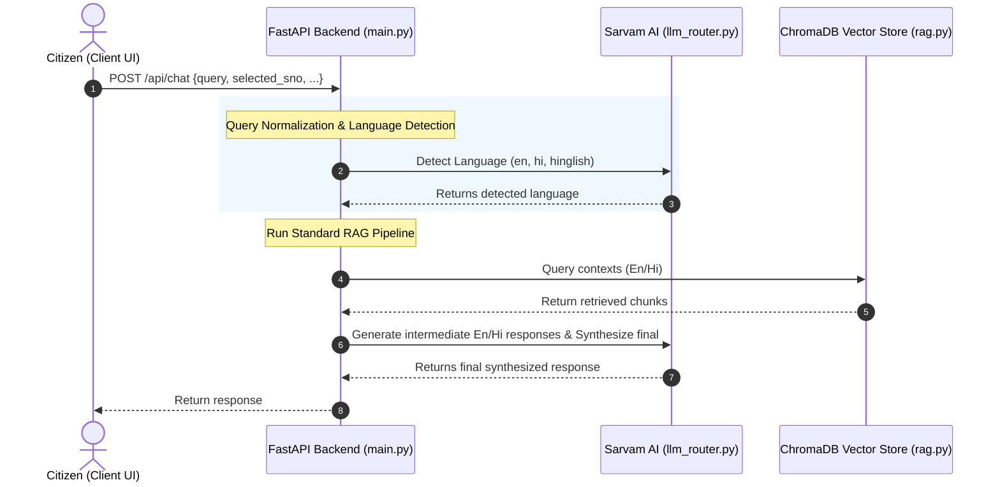

# SewaSetu RAG Chatbot: Full Technical & Product Documentation

This document provides a highly detailed, end-to-end technical overview and architectural guide for the **SewaSetu RAG Chatbot**. This system is specifically designed to act as an AI Sahayak (Assistant) for the **SewaSetu Chhattisgarh Portal**, answering citizen queries regarding public services in **English, Hindi, and Hinglish**, with intelligent document pinning, hybrid reranking, and state-machine-driven location routing.

---

## Table of Contents
1. [Product Overview & Domain Scope](#1-product-overview--domain-scope)
2. [Key Product Features](#2-key-product-features)
3. [Architecture & Message Lifecycle](#3-architecture--message-lifecycle)
4. [Backend Directory & Component Deep Dive](#4-backend-directory--component-deep-dive)
5. [Frontend React Interface & State Machine](#5-frontend-react-interface--state-machine)
6. [Ingestion Pipeline & Vector Database](#6-ingestion-pipeline--vector-database)
7. [Automated Testing & Verification](#7-automated-testing--verification)
8. [Setup & Deployment Guide](#8-setup--deployment-guide)

---

## 1. Product Overview & Domain Scope

The SewaSetu Chhattisgarh Portal provides various government-to-citizen (G2C) services. However, citizens often struggle to understand required documents, service timelines (SLA), fees, and the correct office locations to apply. 

The SewaSetu RAG Chatbot solves this by processing natural language queries and returning factually grounded answers. It is scoped to **5 primary services**:
1. **Marriage Registration & Certificate** (Service ID: `3`, sno: `1`)
2. **SC/ST Caste Certificate** (Service ID: `4`, sno: `2`)
3. **OBC Caste Certificate** (Service ID: `5`, sno: `3`)
4. **Domicile Certificate** (Service ID: `7`, sno: `4`)
5. **Ordinary Gazette Notification for Name Change** (Service ID: `201`, sno: `5`)

---

## 2. Key Product Features

### A. Multilingual Query Translation & Normalization
* **Language Classification:** The system detects if the query is in English, Hindi, or Hinglish using the Sarvam AI LLM.
* **Dual-Query Translation:** English queries are translated to Hindi, and Hindi/Hinglish queries are translated to English, allowing the retriever to fetch context from both English and Hindi knowledge stores in parallel.
* **Term Normalization:** A regex-based normalization layer resolves dialect and colloquial synonyms (e.g., mapping `"niwas praman patra"`, `"residence certificate"`, and `"स्थानीय निवास प्रमाण पत्र"` to Domicile Certificate).

### B. Hybrid Retrieval & Pinning
* **Semantic Embeddings:** Uses the `intfloat/multilingual-e5-large` model to encode chunks and queries.
* **Lexical Scoring:** Computes BM25/TF-IDF lexical matches on raw text.
* **Composite Score:** Reranks candidate chunks using:
  $$\text{Score} = 0.7 \times \text{Semantic Similarity} + 0.3 \times \text{Lexical Overlap}$$
* **Manual Portal Boost (+0.1):** Dynamically applies a `+0.1` boost to all `combined_manual` portal specification chunks. This prioritizes portal rules over raw legal notification texts (such as gazettes and rulebooks) which may be outdated or lack implementation checklists.
* **Checklist Pinning:** If a query contains document, fee, or timeline keywords, the backend isolates the service's `REQUIRED DOCUMENTS` table chunk and pins it to **Rank 1** of the context.


### D. Strict Factual Grounding (Checklist Validation)
* The system enforces strict rules on document status:
  - Documents marked as `(Mandatory: Yes)` or `(Mandatory: हाँ)` are flagged as mandatory.
  - Documents marked as `(Mandatory: No)` or `(Mandatory: नहीं)` are explicitly identified as optional.
  - The LLM is strictly forbidden from inferring document status from User Manual instructions or general notification paragraphs.

### E. Eligibility Criteria Awareness & Dynamic Injection
* **Dynamic Rules Injection:** To prevent prompt pollution, service-specific instructions (such as Domicile eligibility rules or Marriage solemnization registration jurisdiction rules) are loaded dynamically based on the active `service_id` and injected directly into the prompt layers, keeping the global prompts clean.
* **Residency & Education Decoupling:** The system prompts instruct the LLM to read **ALL** eligibility criteria, rules, and exceptions from the retrieved context before answering eligibility questions.
* **Domicile Logic Rules:** The system strictly parses Domicile eligibility logic as `(Criteria One AND Criteria Two) OR (Criteria Three)`. It enforces this logical distinction at both prompt and synthesis stages so that the bot does not incorrectly declare that all criteria groups must be satisfied. It strictly separates Criteria One (Residency/Parent Status) and Criteria Two (CG Education) under separate headers and lists, explaining that options from both categories are required.
* Special attention is given to alternative criteria, exceptions, and special cases (e.g., criteria for spouses of government employees, property holders, All India Services cadre allottees).
* The LLM is forbidden from assuming ineligibility if **any** criterion in the context could apply to the citizen's situation.

### F. Contextual Grounding & RAG Context Injection
* Retrieved Chunks from ChromaDB are directly embedded into the LLM system prompts for both intermediate (English/Hindi) answer generation.
* This ensures the LLM generates answers grounded in actual database content rather than relying on its parametric knowledge, preventing hallucinated document lists or incorrect eligibility determinations.

### G. Conciseness Enforcement (Forbidden Information)
* **Conciseness Enforcement:** The LLM is instructed to answer **ONLY** what the citizen asked, without volunteering unrelated information.
* **Forbidden Information:** If the query is about eligibility, the LLM is strictly forbidden from outputting document lists, process steps, fees, timelines, or contacts. If the query is about a single attribute (SLA, fee, department, or contact), the LLM must return ONLY that value and exclude other metadata fields.
* **Bypassable Interactive Checklist Intercept:** If a citizen asks about documents, they are prompted with choices to check eligibility, read detailed rules, or directly answer the question. If they select "Directly Answer My Question", the backend intercepts the click and bypasses the interactive checklist, rendering a standard text answer.

### H. Polite Tone Enforcement
* All system prompts require warm, respectful, and citizen-friendly language.
* The LLM is forbidden from using harsh, dismissive, blunt, or discouraging phrasing.
* Even when a citizen may not be eligible, the system guides them gently and highlights any alternative paths or exceptions.

### I. Consensus Response Synthesis
* Calls the Sarvam LLM in parallel to generate:
  - An intermediate English response from the English context.
  - An intermediate Hindi response from the Hindi context.
* A final consensus synthesis prompt combines both intermediate answers, resolves conflicts by prioritizing the most informative facts, and outputs a single, cohesive response in the target query language.
* Markdown URLs are sanitized, and a single, official Sewa Setu application button is appended to the message.

### J. Hinglish Script Enforcement
* For Hinglish (Hindi in Roman script) responses, the system applies a multi-layer enforcement:
  - **Prompt-level:** Strong instructions with explicit examples of forbidden Devanagari characters and required Roman transliterations.
  - **Post-processing safety net:** After synthesis, a regex check detects any Devanagari character leakage (`[\u0900-\u097f]`). If detected, a second LLM call automatically transliterates the response to Roman script while preserving meaning and structure.

### K. Structured, Point-Based Layouts
* The LLM is strictly instructed to format all responses using bold markdown headings and bullet-point or numbered lists to prevent cluttered block text. This ensures clean visual spacing, scan-friendly sections, and high readability for citizens.

### L. Pure Script Integrity & Document Conciseness
* **Script Integrity:** To prevent mixing scripts, English terms present in the context (like `affidavit`, `mandatory`) are translated into Devanagari Hindi in Devanagari-mode outputs instead of copying Roman text.
* **Document-Specific Conciseness:** When users ask a narrow question targeting a single document (e.g., whether it is mandatory), the LLM answers only that specific question and is prohibited from dumping the entire document checklist.
* **Devanagari Transliterated Triggers:** Supports common Hindi abbreviations like `एससी`, `एसटी`, `ओबीसी`, `डोमिसाइल`, `मैरिज`, and `गजट` for reliable service auto-classification.

### M. Missing Mandatory Documents Verification
* **Missing Documents Handling:** If a citizen asks what to do if they lack a mandatory document required by the portal (such as the Marriage Invitation Card), the LLM is strictly instructed **not** to suggest that they can submit the application online with only the remaining documents. Instead, it must explicitly state that all mandatory documents (marked as `Mandatory: Yes` or `अनिवार्य: हाँ`) are required for online submission, and guide them to legal or offline alternatives (such as using a solemnization certificate from a priest/institution or applying physically at the local Registrar's office where other proof types can be verified offline under the Compulsory Marriage Registration Rules).

---

## 3. Architecture & Message Lifecycle

The following Mermaid diagram illustrates the lifecycle of a query sent to the `/api/chat` endpoint:



---

## 4. Backend Directory & Component Deep Dive

The backend is built with Python 3.10+ and FastAPI. It consists of the following core modules:

### A. `backend/main.py`
Acts as the root API router, configuring middleware (CORS) and defining Pydantic schemas and endpoints:
* **Pydantic Schemas:**
  - `Message`: Represents roles (`user`, `assistant`, `system`) and content.
  - `ChatRequest`: Standardizes incoming payload structures (supporting `selected_sno`, `messages`, `detailed`).
* **Endpoints:**
  - `GET /api/services`: Returns services manifest metadata.
  - `GET /api/services/{sno}`: Pulls structured metadata profile (fees, SLA, documents list, form fields) from `data/profiles/`.
  - `POST /api/search`: Fast rule-based/semantic catalog classification matching queries to an `sno`.
  - `POST /api/chat`: Standard RAG chatbot handler.
  - `GET /health`: Returns server status.
* **Unified RAG Pipeline:**
  - `run_rag_pipeline(query, request, service_id)`: Drives context retrieval, thread-based parallel completions generation, synthesis rules, regex URL strip rules, and portal apply link injections.

### B. `backend/llm_router.py`
Manages connections and post-processing for the Sarvam AI endpoints:
* `_post_with_retry(url, headers, json_payload)`: Implements exponential backoff retries to handle transient 5xx errors or network socket timeouts.
* `ThinkStripper`: A buffered stream parser that removes `<think> ... </think>` thinking blocks from DeepSeek-based or reasoning-enabled models.
* `detect_query_language(query: str)`: Detects English, Hindi, or Hinglish. Inspects Devanagari unicode characters (`\u0900` to `\u097F`) for fast-path Hindi detection.
* `translate_query_to_english` / `translate_query_to_hindi`: Handles bidirectionally translating query inputs using the LLM.
* **Spelling robustification:** Expanded rule-based keyword mapping for Domicile (`dimicile`, `domisile`, `domocile`) and Marriage (`shaadi`) to resolve classifications correctly on user typos.
* **Strict threshold check:** If the query has no in-scope keywords (e.g. `"koi aur criteria..."`), the semantic database fallback threshold is restricted to `0.33` (instead of `0.45`). If it fails this strict check, LLM classification is bypassed completely. This prevents generic questions from triggering incorrect active service auto-switching.

### C. `backend/rag.py`
Drives database connections and reranking operations:
* `retrieve_context(query, service_id, top_k, english_query, hindi_query, lang)`: Configures checklist keyword match triggers. Performs metadata-filtered ChromaDB vector queries. Evaluates lexical matches. Computes composite scores, applies manual portal manual boosts (`+0.1`), reranks candidates, and returns a formatted context string.

---

## 5. Frontend React Interface & State Machine

The frontend is a single-page React application compiled via Vite. 

### A. Core State Management (`App.jsx`)
Coordinates the chat lifecycle, service listings, sidebar, and details drawer:
```javascript
const [chatMessages, setChatMessages] = useState([]);
const [inputText, setInputText] = useState('');
const [isChatLoading, setIsChatLoading] = useState(false);
```

### B. Interactive Document Checklist (`DocumentChecklist.jsx`)
The frontend contains a highly interactive document verification drawer component [DocumentChecklist.jsx](file:///c:/Users/hp/Desktop/sewa%20setu%20copies/SewaSetuRag%20-%20Copy%20(2)/frontend/src/components/DocumentChecklist.jsx) that evaluates apply eligibility based on user document selections.
* **State Management:**
  - `checkedDocIds`: Tracks checked document ID list.
  - `collapsedGroups`: Tracks collapse toggle state of document card categories.
* **Satisfaction Logic:**
  - A document group is complete if it is marked as `anyOne = true` and at least one supporting document inside the group is checked.
  - If `anyOne = false`, it requires all supporting documents flagged as mandatory to be checked.
* **Reactive Status Banner:**
  - Displays a green success banner if all mandatory groups are satisfied.
  - Displays a warning banner showing missing mandatory group names if some required documents are unchecked.
  - Displays a grey informational banner if no documents have been ticked yet.
* **Action Routing:**
  - Incorporates a direct link to the official Sewa Setu application portal dynamically populated with the target `serviceId`. The apply button remains disabled until the user satisfies all mandatory document criteria.

---

## 6. Ingestion Pipeline & Vector Database

The ingestion pipeline populates the persistent vector database (`chroma_db/`) from raw documentation and official web pages:

1. **Web Services Detail Scraper (`ingestion/scraper/scrape_services.py`):**
   - Scrapes official detail pages on `sewasetu.cgstate.gov.in`.
   - Parses the HTML structure using `BeautifulSoup` to extract details (SLA, department, fees, and contact details).
   - Sends a POST request to the API preview endpoint `https://api-ed.cgstate.gov.in/api/application-management/edistrict2/applicationFormPreviewByServiceId` with the service ID to retrieve form attribute fields in JSON.
   - Downloads referenced instructions PDFs, user manuals, and document format specifications, saving them locally under `data/pdfs/`.
   - Extracts text from downloaded PDFs, generates combined service details manual text files, maps metadata JSON profiles (stored under `data/profiles/`), and compiles them into a unified services details manifest (`data/services_data.json`).
2. **OCR Extraction (`ingestion/ocr_pdfs.py`):** Uses EasyOCR to parse scanned legal acts and notification PDFs (located in `pdf_data/`) into structured txt logs inside `data/ocr_output/`.
3. **Semantic Chunking (`ingestion/chunker.py`):** Splits both the scraped combined manuals (under `data/extracted_text/`) and the OCR outputs (under `data/ocr_output/`) into overlapping semantic chunks of 1500 tokens with 200 tokens overlap using tiktoken encoding.
4. **Embeddings Storage (`ingestion/embed_and_store.py`):** Encodes text chunks using the `intfloat/multilingual-e5-large` sentence-transformer model (incorporating `passage: ` prefix convention for E5 embeddings) and inserts them into ChromaDB with metadata filters (`service_id`, `lang`, `doc_type`, `section`).

## 7. Automated Testing & Verification

The project provides robust testing suites to validate RAG accuracy, language detection, document checklist pinning, and boundary criteria handling.

### A. Document Queries Evaluation Suite
* **Script:** `run_document_queries_evaluation.py`
* **Purpose:** Validates the RAG system across 20 document-related queries in English, Hindi, and Hinglish. It asserts correct language detection, context chunk routing, document status, and response latency. It writes an audit log to `document_queries_evaluation_report.md`.

### B. Comprehensive 50-Query Validation Suite
* **Script:** `scratch/run_50_tests.py`
* **Purpose:** Runs 50 test cases covering basic portal information, tough context-specific conditions, and out-of-scope requests. It progressively commits the results to `test_results.md` after every query, allowing real-time audit verification.

> [!NOTE]
> The active test execution scripts `run_document_queries_evaluation.py` and `scratch/run_50_tests.py` represent the validation framework. If these runner scripts are omitted from your workspace distribution, the previously audited results are preserved for inspection directly in the static report files: [test_results.md](file:///c:/Users/hp/Desktop/sewa%20setu%20copies/SewaSetuRag%20-%20Copy%20(2)/test_results.md) and `document_queries_evaluation_report.md`.
* **Coverage:**
  - 1–20: Basic service info (fees, timeline, documents).
  - 21–40: Tough context-specific scenarios (domicile eligibility logic, Raipur marriage registration jurisdiction, MP Reorganisation Act).
  - 41–50: Out-of-scope queries (home loans, scholarships, weather) verifying correct language-specific fallback messages.

---

## 8. Setup & Deployment Guide

### Configuration (`.env`)
Create a `.env` file at the root containing:
```env
SARVAM_API_KEY="your-sarvam-api-key"
SARVAM_MODEL="sarvam-30b"
SARVAM_API_URL="https://api.sarvam.ai/v1/chat/completions"
EMBEDDING_MODEL="intfloat/multilingual-e5-large"
CHROMA_DB_PATH="./chroma_db"
```

### Steps to Run
1. **Start Backend Server:**
   ```bash
   python -m venv venv
   .\venv\Scripts\Activate.ps1
   pip install -r requirements.txt
   python -m uvicorn backend.main:app --host 127.0.0.1 --port 8000 --reload
   ```
2. **Start Frontend Server:**
   ```bash
   cd frontend
   npm install
   npm run dev
   ```
3. **Verify:** Open `http://localhost:5173` in your browser.
