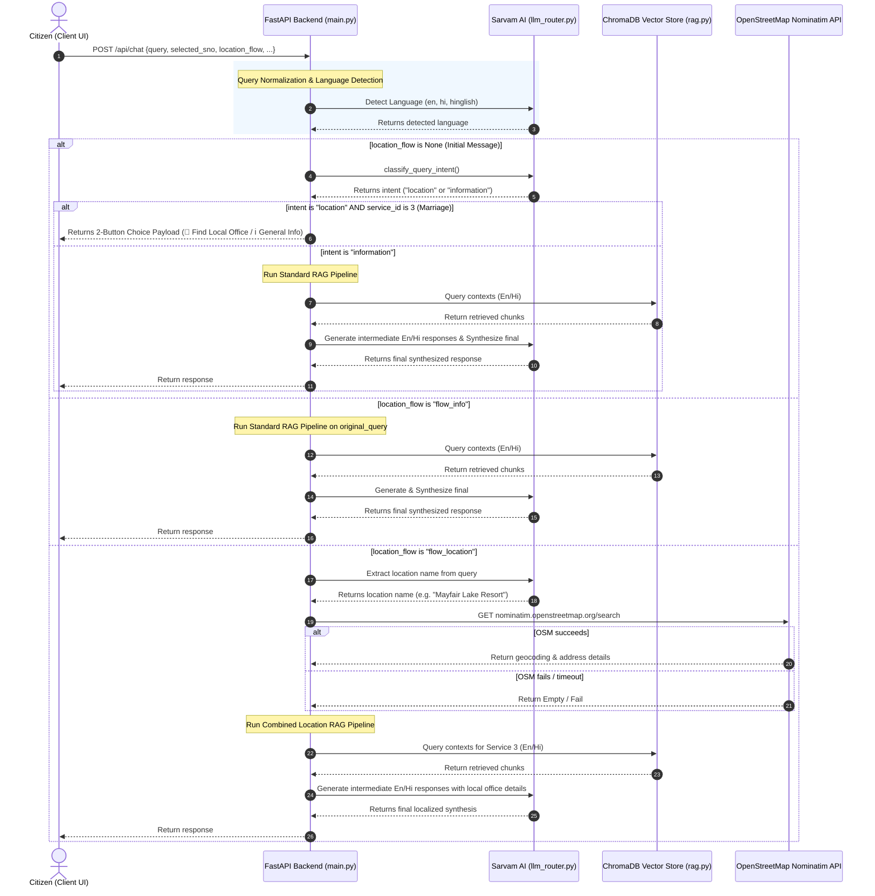

# SewaSetu RAG Chatbot: Full Technical & Product Documentation

This document provides a highly detailed, end-to-end technical overview and architectural guide for the **SewaSetu RAG Chatbot**. This system is specifically designed to act as an AI Sahayak (Assistant) for the **SewaSetu Chhattisgarh Portal**, answering citizen queries regarding public services in **English, Hindi, and Hinglish**, with intelligent document pinning, hybrid reranking, and state-machine-driven location routing.

---

## Table of Contents
1. [Product Overview & Domain Scope](#1-product-overview--domain-scope)
2. [Key Product Features](#2-key-product-features)
3. [Architecture & Message Lifecycle](#3-architecture--message-lifecycle)
4. [Backend Directory & Component Deep Dive](#4-backend-directory--component-deep-dive)
5. [Frontend React Interface & State Machine](#5-frontend-react-interface--state-machine)
6. [Ingestion Pipeline & Vector Database](#6-ingestion-pipeline--vector-database)
7. [Automated Testing & Verification](#7-automated-testing--verification)
8. [Setup & Deployment Guide](#8-setup--deployment-guide)

---

## 1. Product Overview & Domain Scope

The SewaSetu Chhattisgarh Portal provides various government-to-citizen (G2C) services. However, citizens often struggle to understand required documents, service timelines (SLA), fees, and the correct office locations to apply. 

The SewaSetu RAG Chatbot solves this by processing natural language queries and returning factually grounded answers. It is scoped to **5 primary services**:
1. **Marriage Registration & Certificate** (Service ID: `3`, sno: `1`)
2. **SC/ST Caste Certificate** (Service ID: `4`, sno: `2`)
3. **OBC Caste Certificate** (Service ID: `5`, sno: `3`)
4. **Domicile Certificate** (Service ID: `7`, sno: `4`)
5. **Ordinary Gazette Notification for Name Change** (Service ID: `201`, sno: `5`)

---

## 2. Key Product Features

### A. Multilingual Query Translation & Normalization
* **Language Classification:** The system detects if the query is in English, Hindi, or Hinglish using the Sarvam AI LLM.
* **Dual-Query Translation:** English queries are translated to Hindi, and Hindi/Hinglish queries are translated to English, allowing the retriever to fetch context from both English and Hindi knowledge stores in parallel.
* **Term Normalization:** A regex-based normalization layer resolves dialect and colloquial synonyms (e.g., mapping `"niwas praman patra"`, `"residence certificate"`, and `"स्थानीय निवास प्रमाण पत्र"` to Domicile Certificate).

### B. Hybrid Retrieval & Pinning
* **Semantic Embeddings:** Uses the `intfloat/multilingual-e5-large` model to encode chunks and queries.
* **Lexical Scoring:** Computes BM25/TF-IDF lexical matches on raw text.
* **Composite Score:** Reranks candidate chunks using:
  $$\text{Score} = 0.7 \times \text{Semantic Similarity} + 0.3 \times \text{Lexical Overlap}$$
* **Manual Portal Boost (+0.1):** Dynamically applies a `+0.1` boost to all `combined_manual` portal specification chunks. This prioritizes portal rules over raw legal notification texts (such as gazettes and rulebooks) which may be outdated or lack implementation checklists.
* **Checklist Pinning:** If a query contains document, fee, or timeline keywords, the backend isolates the service's `REQUIRED DOCUMENTS` table chunk and pins it to **Rank 1** of the context.

### C. Conversational Location Intent Routing (Service ID 3)
* **Initial Classification:** The LLM classifies if a Marriage Registration query is specifically asking about **where to register/apply** or the **office location** (returns `location`). All other queries return `information`.
* **Interactive Option Buttons:** When `location` is detected, RAG generation is paused, and the backend returns a choice payload:
  - *"📍 Find Local Office"* (triggers frontend text input prompt)
  - *"ℹ️ General Information"* (proceeds to standard RAG pipeline immediately)
* **Explicit Venue Input Prompt:** When the user clicks *"📍 Find Local Office"*, the frontend renders a follow-up assistant prompt: *"Please enter the name of your marriage venue or locality..."* and renders an inline text input box and Search button (no `<form>` tags, React onClick only).
* **Direct Geocoding & Query Substitution:** On submission, the frontend posts `location_name` to the backend. The backend:
  1. Extracts the old venue name from `original_query` (using the LLM).
  2. Replaces the old venue name with the new typed `location_name` case-insensitively in the query string. This ensures RAG retrieval, intermediate answers, and synthesis are executed for the new venue (e.g. `"iiit naya raipur"` instead of the original `"mayfair resort"`).
  3. Queries the OpenStreetMap Nominatim API using a robust 3-strategy lookup pipeline:
     - **Strategy 1 (POI lookup + parent address extraction):** Forward searches Nominatim with the raw `location_name`. If found, extracts `lat` and `lon`, then makes a reverse geocode call at `zoom=10` to resolve the parent administrative boundary and map it to a specific body type (Municipal Corporation, Council, or Gram Panchayat).
     - **Strategy 2 (Locality search fallback):** If Strategy 1 fails, uses the LLM to strip the venue name and extract only the locality/area portion (e.g. `"Naya Raipur"` from `"Mayfair Lake Resort, Naya Raipur"`). Re-runs Nominatim forward search with `{locality}, Chhattisgarh, India` to extract the administrative body details.
     - **Strategy 3 (Graceful degradation):** If both strategies fail or resolve outside Chhattisgarh, it falls back to standard RAG retrieval instructions.
* **Graceful Degradation:** If geocoding fails or times out, the system directly synthesizes the response using only the RAG response, informing the user that the exact venue could not be pinpointed and instructing them to register at the local authority having jurisdiction over the marriage venue.


### D. Strict Factual Grounding (Checklist Validation)
* The system enforces strict rules on document status:
  - Documents marked as `(Mandatory: Yes)` or `(Mandatory: हाँ)` are flagged as mandatory.
  - Documents marked as `(Mandatory: No)` or `(Mandatory: नहीं)` are explicitly identified as optional.
  - The LLM is strictly forbidden from inferring document status from User Manual instructions or general notification paragraphs.

### E. Eligibility Criteria Awareness
* The system prompts instruct the LLM to read **ALL** eligibility criteria, rules, and exceptions from the retrieved context before answering eligibility questions.
* Special attention is given to alternative criteria, exceptions, and special cases (e.g., criteria for spouses of government employees, property holders, All India Services cadre allottees).
* The LLM is forbidden from assuming ineligibility if **any** criterion in the context could apply to the citizen's situation.

### F. Contextual Grounding & RAG Context Injection
* Retrieved chunks from ChromaDB are directly embedded into the LLM system prompts for both intermediate (English/Hindi) answer generation.
* This ensures the LLM generates answers grounded in actual database content rather than relying on its parametric knowledge, preventing hallucinated document lists or incorrect eligibility determinations.

### G. Conciseness Enforcement
* The LLM is instructed to answer **ONLY** what the citizen asked, without volunteering unrelated information.
* Eligibility questions receive only eligibility answers (no document dumps, fees, or process steps).
* Document questions receive only document answers (no eligibility or process information).

### H. Polite Tone Enforcement
* All system prompts require warm, respectful, and citizen-friendly language.
* The LLM is forbidden from using harsh, dismissive, blunt, or discouraging phrasing.
* Even when a citizen may not be eligible, the system guides them gently and highlights any alternative paths or exceptions.

### I. Consensus Response Synthesis
* Calls the Sarvam LLM in parallel to generate:
  - An intermediate English response from the English context.
  - An intermediate Hindi response from the Hindi context.
* A final consensus synthesis prompt combines both intermediate answers, resolves conflicts by prioritizing the most informative facts, and outputs a single, cohesive response in the target query language.
* Markdown URLs are sanitized, and a single, official Sewa Setu application button is appended to the message.

### J. Hinglish Script Enforcement
* For Hinglish (Hindi in Roman script) responses, the system applies a multi-layer enforcement:
  - **Prompt-level:** Strong instructions with explicit examples of forbidden Devanagari characters and required Roman transliterations.
  - **Post-processing safety net:** After synthesis, a regex check detects any Devanagari character leakage (`[\u0900-\u097f]`). If detected, a second LLM call automatically transliterates the response to Roman script while preserving meaning and structure.

---

## 3. Architecture & Message Lifecycle

The following Mermaid diagram illustrates the lifecycle of a query sent to the `/api/chat` endpoint:



---

## 4. Backend Directory & Component Deep Dive

The backend is built with Python 3.10+ and FastAPI. It consists of the following core modules:

### A. `backend/main.py`
Acts as the root API router, configuring middleware (CORS) and defining Pydantic schemas and endpoints:
* **Pydantic Schemas:**
  - `Message`: Represents roles (`user`, `assistant`, `system`) and content.
  - `ChatRequest`: Standardizes incoming payload structures (supporting `selected_sno`, `messages`, `location_flow`, `original_query`, `detailed`).
* **Endpoints:**
  - `GET /api/services`: Returns services manifest metadata.
  - `GET /api/services/{sno}`: Pulls structured metadata profile (fees, SLA, documents list, form fields) from `data/profiles/`.
  - `POST /api/search`: Fast rule-based/semantic catalog classification matching queries to an `sno`.
  - `POST /api/chat`: State-machine-driven conversational chatbot handler.
  - `GET /health`: Returns server status.
* **Unified RAG Pipeline:**
  - `run_rag_pipeline(query, request, service_id, loc_details, is_location_flow)`: Drives context retrieval, thread-based parallel completions generation, synthesis rules, regex URL strip rules, and portal apply link injections.

### B. `backend/location_service.py`
Hosts the integration with OpenStreetMap Nominatim and query parsing:
* `geocode_location(location_name: str)`: Calls Nominatim with rate-limit headers. Appends `", Chhattisgarh, India"` if search fails initially. Validates state boundaries. Extracts address fields (`suburb`, `city`, `town`, `village`, `municipality`, `county`). Automatically maps the administrative body structure (`Municipal Corporation`, `Municipal Council`, or `Gram Panchayat`).
* `extract_location_from_query(query: str)`: Prompts the Sarvam model to strip verbs and conversational filler, returning only the name of the venue, landmark, or village mentioned in the query.

### C. `backend/llm_router.py`
Manages connections and post-processing for the Sarvam AI endpoints:
* `_post_with_retry(url, headers, json_payload)`: Implements exponential backoff retries to handle transient 5xx errors or network socket timeouts.
* `ThinkStripper`: A buffered stream parser that removes `<think> ... </think>` thinking blocks from DeepSeek-based or reasoning-enabled models.
* `detect_query_language(query: str)`: Detects English, Hindi, or Hinglish. Inspects Devanagari unicode characters (`\u0900` to `\u097F`) for fast-path Hindi detection.
* `translate_query_to_english` / `translate_query_to_hindi`: Handles bidirectionally translating query inputs using the LLM.
* `classify_service(query, services_list)`: First applies rule-based keyword triggers, then semantic database lookups, and falls back to LLM classifications for complex prompts.
* `classify_query_intent(query, service_id)`: Implements intent classification for marriage location queries.

### D. `backend/rag.py`
Drives database connections and reranking operations:
* `retrieve_context(query, service_id, top_k, english_query, hindi_query, lang)`: Configures checklist keyword match triggers. Performs metadata-filtered ChromaDB vector queries. Evaluates lexical matches. Computes composite scores, applies manual portal manual boosts (`+0.1`), reranks candidates, and returns a formatted context string.

### E. `chatbotlocation/` — Standalone Geospatial Resolution Microservice
A separate FastAPI microservice (port 8001) providing geospatial resolution for marriage registration venues:

#### `chatbotlocation/services/geocoding_service.py`
* **`parse_venue_and_locality(raw_input)`:** Preprocessing step that separates branded venue names from city/locality using dash → comma → whitespace parsing rules. Strips decorator keywords ("Resort", "Vatika", "Wedding Place", "Banquet Hall", etc.) from venue names.
* **`LANDMARK_OVERRIDES` dict:** Hardcoded coordinates for common Chhattisgarh marriage venues (Mayfair Lake Resort, Hyatt Raipur, Jharokha, Mana Camp, etc.) with lat/lon and locality metadata.
* **`get_override_coordinates(cleaned_query)`:** Fuzzy override matching using `rapidfuzz.fuzz.token_set_ratio ≥ 75` with normalized input (lowercase, no punctuation, no filler words).
* **`geocode_location_pipeline(location_name)`:** Three-attempt cascaded Nominatim strategy:
  - Attempt 1: Venue + locality combined query
  - Attempt 2: Locality-only fallback (sets `venue_resolved=False`)
  - Attempt 3: Existing fuzzy retry pipeline (simplified + parent locality queries)
* Debug logging (`[GEO]` prefix) at every stage for pipeline observability.

#### `chatbotlocation/services/confidence_scorer.py`
* **`score_confidence(..., venue_resolved, locality_used)`:** When `venue_resolved=False`, overrides base score to 0.65 and appends: "Exact venue could not be pinpointed; jurisdiction resolved from {locality}."

#### `chatbotlocation/services/boundary_hierarchy_service.py`
* Extracts administrative boundaries using Overpass `is_in` queries and 5km radius fallbacks.
* Resolves district, block, and area hierarchy from enclosing/nearby boundary relations.

#### `chatbotlocation/services/jurisdiction_classifier.py`
* Classifies resolved boundaries into body types: Municipal Corporation, Nagar Palika Parishad, Nagar Panchayat, or Gram Panchayat.

---

## 5. Frontend React Interface & State Machine

The frontend is a single-page React application compiled via Vite. 

### A. Core State Management (`App.jsx`)
Coordinates the chat lifecycle and details drawer:
```javascript
const [locationFlow, setLocationFlow] = useState(null); // 'flow_location', 'flow_info', or null
const [originalQuery, setOriginalQuery] = useState(null);
const [activeServiceId, setActiveServiceId] = useState(null);
const [chatMessages, setChatMessages] = useState([]);
const [inputText, setInputText] = useState('');
```

### B. Interactive Buttons Rendering & Interactions
* When an assistant message has options (e.g. `msg.options`), they are rendered as button chips.
* **Option Click Handler (`handleOptionClick`):**
  1. Sets `msg.disabled = true` on the message containing the options to prevent double clicks.
  2. Appends the user's choice (e.g. `📍 Find Local Office`) to `chatMessages`.
  3. Updates `locationFlow` to `"flow_location"`.
  4. Dispatches a POST request to `/api/chat` passing the `location_flow` and `original_query` in the payload.
  5. On response, updates the active states and appends the final reply.

### C. Styling & Micro-Animations (`App.css`)
* Custom styles added for `.message-options-container` and `.option-btn`.
* Handles smooth background color hover transitions, scale down active states, and disabled opacity formatting.

---

## 6. Ingestion Pipeline & Vector Database

The ingestion pipeline populates the persistent vector database (`chroma_db/`) from raw documentation:

1. **OCR Extraction (`ingestion/ocr_pdfs.py`):** Uses EasyOCR to parse scanned PDF manuals (located in `data/pdf_data/`) into structured txt logs inside `data/ocr_output/`.
2. **Semantic Chunking (`ingestion/chunker.py`):** Splits the raw texts into overlapping chunks, identifying service tables, headers, and metadata rules.
3. **Embeddings Storage (`ingestion/embed_and_store.py`):** Encodes text chunks using `intfloat/multilingual-e5-large` and inserts them into ChromaDB with metadata filters (`service_id`, `lang`).

---

## 7. Automated Testing & Verification

A dedicated automated test suite is provided to verify routing states and edge cases:

* **Test Suite:** `backend/test_conversational_location.py`
* **Test Cases Covered:**
  1. **Option Triggers:** Checks that location queries on Marriage Registration trigger options payloads.
  2. **Info Queries:** Verifies document queries bypass options and proceed straight to RAG.
  3. **Out-of-Scope Protection:** Confirms other services do NOT trigger location routing.
  4. **Buttons Redirections:** Confirms choosing general info performs a standard RAG search.
  5. **Geocoding Integrations:** Confirms successful geocoding returns localized administrative office names.
  6. **Geocoding Failure Fallback:** Asserts that when geocoding is unsuccessful (or times out), it defaults gracefully to generic Municipal/Gram Panchayat office guidelines.
* **Run Command:**
  ```bash
  python -m pytest backend/test_conversational_location.py
  ```

---

## 8. Setup & Deployment Guide

### Configuration (`.env`)
Create a `.env` file at the root containing:
```env
SARVAM_API_KEY="your-sarvam-api-key"
SARVAM_MODEL="sarvam-30b"
SARVAM_API_URL="https://api.sarvam.ai/v1/chat/completions"
EMBEDDING_MODEL="intfloat/multilingual-e5-large"
CHROMA_DB_PATH="./chroma_db"
```

### Steps to Run
1. **Start Backend Server:**
   ```bash
   python -m venv venv
   .\venv\Scripts\Activate.ps1
   pip install -r requirements.txt
   python -m uvicorn backend.main:app --host 127.0.0.1 --port 8000 --reload
   ```
2. **Start Frontend Server:**
   ```bash
   cd frontend
   npm install
   npm run dev
   ```
3. **Verify:** Open `http://localhost:5173` in your browser.
