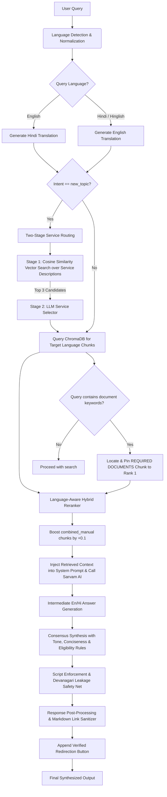

# 🤝 SewaSetu RAG Chatbot

SewaSetu RAG Chatbot is an enterprise-grade **Retrieval-Augmented Generation (RAG)** assistant designed specifically for the **SewaSetu Chhattisgarh Portal** services. 

It empowers citizens to ask complex, domain-specific questions about government services (such as Domicile Certificates, Marriage Registration, Caste Certificate rules, and Gazette notifications) and receive highly accurate, structured, and factually grounded responses in their preferred language: **English, Hindi, or Hinglish**.

---

## 📐 System Architecture

The following diagram illustrates the query processing flow, including language detection, two-stage service routing, RAG retrieval, consensus synthesis, and real-time grounding guardrails:



---

## 🌟 Key Features

### 1. Multilingual Orchestration & Normalization
* **Language Classifier:** Automatically detects query language (`en`, `hi`, `hinglish`) using the LLM.
* **Dual-Query Translation:** Translates user queries bidirectionally (English $\leftrightarrow$ Hindi) using the LLM to perform cross-lingual RAG retrieval.
* **Term Normalization:** Resolves dialect/colloquial variances (e.g., mapping `"niwas praman patra"`, `"residence certificate"`, and `"मूल निवासी प्रमाण पत्र"` to a single unified service category).

### 2. Scalable Two-Stage Service Routing
To support scaling to hundreds of G2C services without prompt pollution or classification degradation:
* **Stage 1 (Semantic Candidate Search):** Embeds the query using `multilingual-e5-large` and performs a cosine similarity search against service catalog descriptions in `01_preprocessing/data/rag_kb_manifest.json` to retrieve the **Top 3** candidate services.
* **Stage 2 (LLM Classification):** Prompts the LLM to classify the query to one of these Top 3 candidates, adding specialized targeting exception rules (e.g., routing Domicile eligibility queries to Domicile rather than over-generalizing to Caste).

### 3. Hybrid Reranking & Portal Prioritization
* **Semantic Embedding:** Embeds chunks using the `intfloat/multilingual-e5-large` model.
* **Hybrid Scoring System:** Reranks candidate database chunks using a composite score:
  $$\text{Score} = 0.7 \times \text{Semantic Similarity} + 0.3 \times \text{Lexical Overlap}$$
* **Portal Boost (+0.1):** Dynamically applies a `+0.1` boost to all `combined_manual` portal specification chunks. This prioritizes portal rules over raw legal notification texts (such as gazettes and rulebooks) which may be outdated or lack implementation checklists.
* **Devanagari Tokenizer:** Utilizes a Unicode-aware word boundary tokenizer that preserves Hindi half-letters and conjuncts, preventing lexical score dilution.

### 4. Checklist Pinning & Context Routing
* **Intelligent Pinning:** When the query mentions document requirements, checklists, fees, or timeline keywords, the backend isolates the specific service's `REQUIRED DOCUMENTS` table chunk and pins it directly to **Rank 1** of the context.
* **Dynamic Pool Expansion:** Expands search pool to `top_k = 15` chunks when a user queries without specifying a service category (`service_id=None`) to prevent relevant chunks from being crowded out.

### 5. API Resilience & Clean Post-Processing
* **Transient Error Handling:** Utilizes an exponential backoff retry mechanism (`_post_with_retry`) on all Sarvam completions to handle transient 500, 502, 503, 504 errors and API timeouts.
* **URL Sanitizer:** Strips LLM-generated markdown links or buttons from final outputs and appends a single, verified redirection button linking to the official portal page.

### 6. Contextual Grounding & Response Quality
* **Contextual Grounding:** Retrieved chunks are directly embedded into the LLM system prompts for both intermediate (English/Hindi) answer generation, ensuring the LLM is grounded on actual database content rather than its parametric knowledge.
* **Dynamic Rules Injection:** Loads service-specific instructions (such as Domicile eligibility rules or Marriage solemnization registration jurisdiction rules) dynamically based on the active `service_id` and injects them directly into the prompt layers, keeping the global prompts clean.
* **State-Aware History & Context Isolation:** Cleans conversation history using `sanitize_history`, limits history to the last 6 messages (3 turns) on the client, and restricts RAG generation history to the last 1 turn plus a previous topic summary to solve "triple-amplification". For service switches, history is completely cleared.
* **Prompt-Based Classifier Safety Nets:** Tuning instructions in `05_webui/backend/llm_router.py` prevent service process, fee, or document queries (e.g. Hinglish "caste certificate kaise banayein") from being incorrectly hijacked by early canned responses (like `identity` or `out_of_scope`).
* **Programmatic Switch Safety Net:** If the classifier fails during an active service switch, `query_contains_service_keywords()` intercepts the switch, overrides the intent to `new_topic`, and clears history to isolate the database context.
* **Eligibility Criteria Awareness:** The system prompts instruct the LLM to read ALL eligibility criteria, rules, and exceptions from the context before answering — including alternative criteria for spouses, government employees, property holders, and other special cases. Domicile eligibility requires strictly splitting the main path rules into two distinct requirements under separate headers (Criteria One and Criteria Two) and enforcing that both must be satisfied.
* **Forbidden Information Conciseness:** The LLM is instructed to answer ONLY what the citizen asked, without volunteering unrelated information. If the query is about eligibility, the LLM is strictly forbidden from outputting document lists, process steps, fees, timelines, or contacts. If the query is about a single attribute (SLA, fee, department, or contact), the LLM must return ONLY that value and exclude other metadata fields.
* **Bypassable Interactive Checklist Intercept:** If a citizen asks about documents, they are prompted with choices to check eligibility, read detailed rules, or directly answer the question. If they select "Directly Answer My Question", the backend intercepts the click and bypasses the interactive checklist, rendering a standard text answer.
* **Polite Tone Enforcement:** All system prompts require warm, respectful, citizen-friendly language. The LLM is forbidden from using harsh, dismissive, or discouraging phrasing.
* **Structured, Point-Based Layouts:** The LLM is strictly instructed to format all responses using bold markdown headings and bullet-point or numbered lists to prevent cluttered block text, keeping the interface clean and easy to scan.
* **Script & Translation Integrity:** Enforces pure script output (standard English for English queries, and pure Devanagari Hindi for Hindi queries). English terms extracted from RAG context are translated into Hindi Devanagari inside the consensus phase instead of copying Roman text.
* **Hinglish Script Safety Net:** For Hinglish responses, a post-processing step detects any Devanagari character leakage and automatically re-converts the response to Roman-script Hinglish via a transliteration LLM call.

---

## 📂 Project Directory Structure

```text
SewaSetuRag/
├── 01_preprocessing/                    # Stage 1: Document Processing, Scraping & OCR
│   ├── ocr_pdfs.py                      # Uses EasyOCR to extract text from scanned PDFs
│   ├── scraper/
│   │   └── scrape_services.py           # Web scraper compiling service metadata profiles
│   └── data/                            # Scraped and extracted raw/intermediate datasets
│       ├── pdf_data/                    # Raw source scanned legal PDFs
│       ├── ocr_output/                  # Output text files generated by EasyOCR (Acts/Rules)
│       ├── extracted_text/              # Combined portal manuals
│       ├── profiles/                    # Structured JSON profiles for services
│       ├── rag_kb_manifest.json         # Services catalog manifest file
│       └── services_data.json           # Scraped raw service forms data
├── 02_optimization/                     # Stage 2: normalizations (placeholder)
├── 03_chunking/                         # Stage 3: Semantic Text Chunking
│   └── chunker.py                       # Splits text files into overlapping semantic RAG chunks
├── 04_embeddings_and_kg/                # Stage 4: Database Storage & Embedding Generation
│   ├── embed_and_store.py               # Embeds chunks and inserts them into ChromaDB
│   ├── chroma_db/                       # Persistent ChromaDB Vector Store
│   └── data/                            # Post-chunked data
│       └── chunks.json                  # Ingestion pipeline cache
├── 05_webui/                            # Stage 5: Web User Interface & Backend Router
│   ├── backend/                         # FastAPI Backend
│   │   ├── main.py                      # API router, schemas, translation, synthesis
│   │   ├── rag.py                       # Vector search client, checklist pinning, reranking
│   │   └── llm_router.py                # Sarvam AI completions, service classifier, grounding check
│   └── frontend/                        # Vite-React User Interface
│       ├── src/                         # React components, stylesheet, App files
│       ├── public/                      # Static assets and portal logo assets
│       ├── package.json                 # Dependency configuration
│       └── vite.config.js               # Development proxy settings
├── docs/                                # Technical & System Documentation
│   ├── PROJECT_DOCUMENTATION.md         # Comprehensive system overview
│   ├── answerRetrieval.md               # Explanation of answer retrieval workflow
│   ├── api.md                           # Backend API and integration guide
│   ├── history.md                       # History management & context isolation
│   ├── two_stage_routing_progress.md    # Two-stage routing progress log
│   └── rag_pipeline_architecture.md     # RAG pipeline architectural details
├── tests/                               # Verification test suites
│   ├── run_validation.py                # Main 50-query validation script
│   ├── run_confused_validation.py       # Confusing Hinglish queries validation
│   ├── run_confused_validation_hindi.py # Confusing Hindi queries validation
│   ├── run_random_50_tests.py           # Random 50 queries validation
│   ├── summary_table.md                 # Summary of run_validation.py results
│   ├── evaluation_results.md            # Audit report from run_validation.py
│   ├── confused_queries_results.md      # Audit report from run_confused_validation.py
│   ├── confused_queries_results_hindi.md# Audit report from run_confused_validation_hindi.py
│   ├── random_50_test_results.md        # Audit report from run_random_50_tests.py
│   └── adversarial_evaluation_results.md# Adversarial evaluation results
├── requirements.txt                     # Backend Python dependencies
├── .env.example                         # Environment configuration template
└── README.md                            # Main system guide
```

---

## 🛠️ Environment Configurations

The system is configured using an `.env` file at the root.

| Environment Variable | Description | Default |
|----------------------|-------------|---------|
| `EMBEDDING_MODEL` | Hugging Face model used for semantic database embedding | `intfloat/multilingual-e5-large` |
| `CHROMA_DB_PATH` | Persistent directory path for ChromaDB storage | `./04_embeddings_and_kg/chroma_db` |
| `SARVAM_API_KEY` | Developer access token for Sarvam AI | *Required* |
| `SARVAM_MODEL` | Large language model utilized for completions | `sarvam-30b` |
| `SARVAM_API_URL` | Base API target URL for Sarvam completions | `https://api.sarvam.ai/v1/chat/completions` |
| `POPPLER_PATH` | Path to the poppler binary folder on Windows (needed for OCR) | *Optional* |

---

## 🚀 Step-by-Step Setup Instructions

### Prerequisites
* **Python** 3.10 or higher
* **Node.js** 18 or higher
* [Optional] **Poppler** (required if parsing raw PDFs through the OCR pipeline)

---

### Step 1: Backend Setup
1. **Clone** the repository and open your terminal in the root project folder.
2. Initialize and activate a Python virtual environment:
   ```bash
   python -m venv venv
   # Windows (PowerShell):
   .\venv\Scripts\Activate.ps1
   # Linux/macOS:
   source venv/bin/activate
   ```
3. Install the dependencies listed in `requirements.txt`:
   ```bash
   pip install -r requirements.txt
   ```
4. Copy `.env.example` to `.env` and fill in your `SARVAM_API_KEY`:
   ```bash
   cp .env.example .env
   ```
5. Start the main FastAPI backend development server (runs on port 8000):
   ```bash
   python -m uvicorn 05_webui.backend.main:app --host 127.0.0.1 --port 8000 --reload
   ```

---

### Step 2: Frontend Setup
1. Navigate to the `frontend` folder:
   ```bash
   cd 05_webui/frontend
   ```
2. Install the necessary node packages:
   ```bash
   npm install
   ```
3. Start the Vite React development server:
   ```bash
   npm run dev
   ```
4. Open your browser and navigate to `http://localhost:5173`.

---

### Step 3: Run the Ingestion Pipeline (Optional)
If you want to scrape the portal, update manuals, re-extract PDFs, or rebuild the vector store database:
1. Clear the persistent database directory:
   ```bash
   rm -rf 04_embeddings_and_kg/chroma_db/
   ```
2. Run the Web Scraper to fetch the latest instruction HTML tables, PDFs, and forms preview structures:
   ```bash
   python 01_preprocessing/scraper/scrape_services.py
   ```
3. Run EasyOCR on the source PDF rules/manuals:
   ```bash
   python 01_preprocessing/ocr_pdfs.py
   ```
4. Run the chunker to split both the scraped combined manuals and OCR outputs into overlapping semantic chunks:
   ```bash
   python 03_chunking/chunker.py
   ```
5. Embed chunks and store them in ChromaDB:
   ```bash
   python 04_embeddings_and_kg/embed_and_store.py
   ```