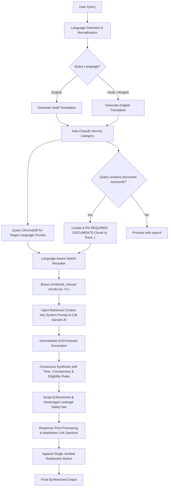

# SewaSetu RAG Chatbot

SewaSetu RAG Chatbot is an enterprise-grade Retrieval-Augmented Generation (RAG) system tailored specifically for the **SewaSetu Chhattisgarh Portal** services. It enables citizens to ask complex, domain-specific questions about government services (such as Domicile Certificates, Marriage Registration, Caste Certificate rules, and Gazette notifications) and receive highly accurate, structured, and factually grounded responses in their preferred language (**English, Hindi, or Hinglish**).

---

## 📐 System Architecture

The following diagram illustrates the end-to-end query processing and retrieval pipeline of the SewaSetu RAG Chatbot:



---

## 🌟 Key Features

### 1. Multilingual Orchestration & Normalization
* **Language Classifier:** Automatically detects query language (`en`, `hi`, `hinglish`) using the LLM.
* **Dual-Query Translation:** Translates user queries bidirectionally (English <-> Hindi) using `sarvam-translate:v1` to perform cross-lingual RAG retrieval.
* **Term Normalization:** Resolves dialect/colloquial variances (e.g., matching "niwas praman patra", "residence certificate", and "मूल निवासी प्रमाण पत्र" to a single unified service category).

### 2. Hybrid Reranking & Portal Prioritization
* **Semantic Embedding:** Embeds chunks using the `intfloat/multilingual-e5-large` model.
* **Hybrid Scoring System:** Reranks candidate database chunks using a composite score:
  $$\text{Score} = 0.7 \times \text{Semantic Similarity} + 0.3 \times \text{Lexical Overlap}$$
* **Portal Boost (+0.1):** Dynamically applies a `+0.1` boost to all `combined_manual` portal specification chunks. This prioritizes portal rules over raw legal notification texts (such as gazettes and rulebooks) which may be outdated or lack implementation checklists.
* **Devanagari Tokenizer:** Utilizes a Unicode-aware word boundary tokenizer that preserves Hindi half-letters and conjuncts, preventing lexical score dilution.

### 3. Checklist Pinning & Context Routing
* **Intelligent Pinning:** When the query mentions document requirements, checklist, fees, or timeline keywords, the backend isolates the specific service's `REQUIRED DOCUMENTS` table chunk and pins it directly to **Rank 1** of the context.
* **Dynamic Pool Expansion:** Expands search pool to `top_k = 15` chunks when a user queries without specifying a service category (`service_id=None`) to prevent relevant chunks from being crowded out.

### 4. API Resilience & Clean Post-Processing
* **Transient Error Handling:** Utilizes an exponential backoff retry mechanism (`_post_with_retry`) on all Sarvam completions to handle transient 500, 502, 503, 504 errors and API timeouts.
* **URL Sanitizer:** Strips LLM-generated markdown links or buttons from final outputs and appends a single, verified redirection button linking to the official portal page.

### 5. Contextual Grounding & Response Quality
* **RAG Context Injection:** Retrieved chunks are directly embedded into the LLM system prompts for both intermediate (English/Hindi) answer generation, ensuring the LLM is grounded on actual database content rather than its parametric knowledge.
* **Eligibility Criteria Awareness:** The system prompts instruct the LLM to read ALL eligibility criteria, rules, and exceptions from the context before answering — including alternative criteria for spouses, government employees, property holders, and other special cases.
* **Conciseness Enforcement:** The LLM is instructed to answer ONLY what the citizen asked, without volunteering unrelated information (e.g., not dumping document lists when only eligibility was asked). Special conciseness rules apply to single-document queries (e.g. asking whether one specific document is mandatory), which prevent the model from dumping the entire document checklist.
* **Polite Tone Enforcement:** All system prompts require warm, respectful, citizen-friendly language. The LLM is forbidden from using harsh, dismissive, or discouraging phrasing.
* **Structured, Point-Based Layouts:** The LLM is strictly instructed to format all responses using bold markdown headings and bullet-point or numbered lists to prevent cluttered block text, keeping the interface clean and easy to scan.
* **Script & Translation Integrity:** Enforces pure script output (standard English for English queries, and pure Devanagari Hindi for Hindi queries). English terms extracted from RAG context are translated into Hindi Devanagari inside the consensus phase instead of copying Roman text.
* **Hinglish Script Safety Net:** For Hinglish responses, a post-processing step detects any Devanagari character leakage and automatically re-converts the response to Roman-script Hinglish via a transliteration LLM call.

---

## 📂 Project Directory Structure

```text
SewaSetuRag/
├── backend/                             # Python FastAPI Backend
│   ├── main.py                          # API router, request schemas, translation, response synthesis
│   ├── rag.py                           # Vector search client, checklist pinning, custom hybrid reranker
│   └── llm_router.py                    # Sarvam AI API clients, service classifier, and HTTP retry wrapper
├── frontend/                            # Vite-React Single Page Application
│   ├── public/                          # Static assets and icons
│   ├── src/
│   │   ├── App.css                      # Styling variables, animations, and typography
│   │   ├── App.jsx                      # Chat screen, service sidebar catalog, and status panel
│   │   ├── index.css                    # Tailwind utility hooks and global configurations
│   │   ├── main.jsx                     # React client renderer
│   │   └── assets/                      # Shared vector graphics
│   ├── package.json                     # NPM script definitions and packages
│   └── vite.config.js                   # Vite configuration
├── ingestion/                           # Raw Document Processing Pipeline
│   ├── ocr_pdfs.py                      # Uses EasyOCR to extract plain text from scanned PDFs
│   ├── chunker.py                       # Splits text files into overlapping semantic RAG chunks
│   └── embed_and_store.py               # Embeds chunks and inserts them into ChromaDB
├── data/                                # System Data Manifests
│   ├── pdf_data/                        # Raw source scanned legal PDFs
│   ├── ocr_output/                      # Output text files generated by EasyOCR (Acts/Rules)
│   ├── extracted_text/                  # Manual portal checklists & specifications
│   ├── profiles/                        # Structured JSON files mapping portal metadata
│   ├── rag_kb_manifest.json             # Root services catalog manifest
│   └── chunks.json                      # Ingestion pipeline cache
├── chroma_db/                           # Persistent ChromaDB Vector Store
├── requirements.txt                     # Backend Python dependencies
├── .env.example                         # Template configuration environment file
└── README.md                            # Comprehensive project guide
```

---

## 🛠️ Environment Configurations

The system is configured using an `.env` file at the root.

| Environment Variable | Description | Default |
|----------------------|-------------|---------|
| `EMBEDDING_MODEL` | Hugging Face model used for semantic database embedding | `intfloat/multilingual-e5-large` |
| `CHROMA_DB_PATH` | Persistent directory path for ChromaDB storage | `./chroma_db` |
| `SARVAM_API_KEY` | Developer access token for Sarvam AI | *Required* |
| `SARVAM_MODEL` | Large language model utilized for completions | `sarvam-30b` |
| `SARVAM_API_URL` | Base API target URL for Sarvam completions | `https://api.sarvam.ai/v1/chat/completions` |

---

## 🚀 Setup & Setup Instructions

### Prerequisites
* Python 3.10 or higher
* Node.js 18 or higher
* [Optional] Poppler (required if parsing raw PDFs through the OCR pipeline)

---

### Step 1: Backend Setup
1. **Clone** the repository and navigate to the project directory.
2. Initialize and activate a Python virtual environment:
   ```bash
   python -m venv venv
   # Windows (PowerShell):
   .\venv\Scripts\Activate.ps1
   # Linux/macOS:
   source venv/bin/activate
   ```
3. Install the dependencies listed in `requirements.txt`:
   ```bash
   pip install -r requirements.txt
   ```
4. Copy `.env.example` to `.env` and fill in your `SARVAM_API_KEY`:
   ```bash
   cp .env.example .env
   ```
5. Start the main FastAPI backend development server (runs on port 8000):
   ```bash
   python -m uvicorn backend.main:app --host 127.0.0.1 --port 8000 --reload
   ```

---

### Step 2: Frontend Setup
1. Navigate to the `frontend` folder:
   ```bash
   cd frontend
   ```
2. Install the necessary node packages:
   ```bash
   npm install
   ```
3. Start the Vite React development server:
   ```bash
   npm run dev
   ```
4. Access the client UI in your browser at `http://localhost:5173`.

---

### Step 3: Run the Ingestion Pipeline (Optional)
If you want to update, re-extract, or overwrite the vector store database:
1. Clear the persistent database directory:
   ```bash
   rm -rf chroma_db/
   ```
2. Run EasyOCR on all source PDF rules/manuals:
   ```bash
   python ingestion/ocr_pdfs.py
   ```
3. Chunk, embed, and store all documents in ChromaDB:
   ```bash
   python ingestion/embed_and_store.py
   ```

---

## 🧪 Automated Testing & Evaluation Suite

We provide specialized test frameworks to evaluate query classification routing, document checklist extraction, and multi-language response formats.

### 1. Document Queries Evaluation Runner
To verify the accuracy of the bot across 20 document-related test cases (covering English, Hindi, and Hinglish queries):
```bash
python run_document_queries_evaluation.py
```
This generates `document_queries_evaluation_report.md` showing:
* Language classifier validation.
* Database query classification accuracy.
* Context chunk pinning state checks.
* LLM grounding and mandatory vs. optional checklist assertions.
* Latency statistics.

### 2. Comprehensive 50-Query Validation Runner
To run a comprehensive test of 50 queries covering basic information, tough/detailed context specific questions (e.g. domicile eligibility and marriage registration location rules), and out-of-scope requests:
```bash
python scratch/run_50_tests.py
```
This progressively logs results after every question and saves the full audit report as [test_results.md](file:///c:/Users/hp/Desktop/SewaSetuRag%20-%20Copy%20%282%29/test_results.md) showing:
* Response latencies.
* Language detection accuracy.
* Auto-mapped Service IDs.
* Full bot responses in English, Hindi, and Hinglish.

---

## 🌐 API Endpoint Documentation

### 1. List All Services
* **Route:** `GET /api/services`
* **Response Payload Structure:**
```json
[
  {
    "sno": "3",
    "service_id": 3,
    "name_en": "Marriage Registration & Certificate",
    "name_hi": "विवाह पंजीकरण एवं प्रमाण पत्र",
    "dept_en": "Urban Administration and development Department",
    "dept_hi": "नगरीय प्रशासन एवं विकास विभाग",
    "is_internal": true
  }
]
```

### 2. Chat with RAG Bot
* **Route:** `POST /api/chat`
* **Request Payload Structure:**
```json
{
  "query": "Is a Marriage Invitation Card mandatory for marriage registration?",
  "service_id": 3,
  "lang": "en",
  "detailed": true
}
```
* **Response Output:** Returns an SSE stream that yields the final synthesized text block, structured checklist confirmations, and the redirection target URL.# SewaSetuRag-Copy-2

