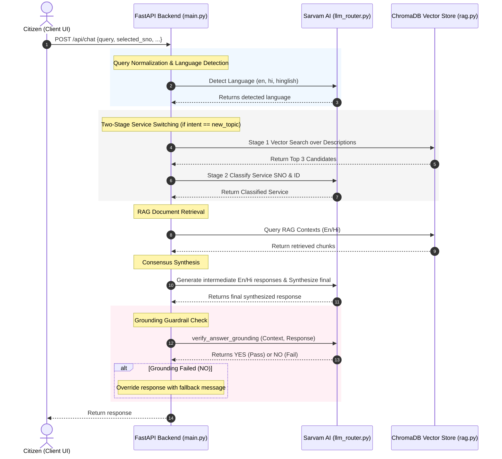

# SewaSetu RAG Chatbot: Full Technical & Product Documentation

This document provides a highly detailed, end-to-end technical overview and architectural guide for the **SewaSetu RAG Chatbot**. This system is specifically designed to act as an AI Sahayak (Assistant) for the **SewaSetu Chhattisgarh Portal** services. It enables citizens to ask complex, domain-specific questions about government services (such as Domicile Certificates, Marriage Registration, Caste Certificate rules, and Gazette notifications) and receive highly accurate, structured, and factually grounded responses in their preferred language (**English, Hindi, or Hinglish**).

---

## Table of Contents
1. [Product Overview & Domain Scope](#1-product-overview--domain-scope)
2. [Key Product Features](#2-key-product-features)
3. [Architecture & Message Lifecycle](#3-architecture--message-lifecycle)
4. [Backend Directory & Component Deep Dive](#4-backend-directory--component-deep-dive)
5. [Frontend React Interface & State Machine](#5-frontend-react-interface--state-machine)
6. [Ingestion Pipeline & Vector Database](#6-ingestion-pipeline--vector-database)
7. [Automated Testing & Verification](#7-automated-testing--verification)
8. [Setup & Deployment Guide](#8-setup--deployment-guide)

---

## 1. Product Overview & Domain Scope

The SewaSetu Chhattisgarh Portal provides various government-to-citizen (G2C) services. However, citizens often struggle to understand required documents, service timelines (SLA), fees, and the correct office locations to apply. 

The SewaSetu RAG Chatbot solves this by processing natural language queries and returning factually grounded answers. It is scoped to **5 primary services**:
1. **Marriage Registration & Certificate** (Service ID: `3`, sno: `1`)
2. **SC/ST Caste Certificate** (Service ID: `4`, sno: `2`)
3. **OBC Caste Certificate** (Service ID: `5`, sno: `3`)
4. **Domicile Certificate** (Service ID: `7`, sno: `4`)
5. **Ordinary Gazette Notification for Name Change** (Service ID: `201`, sno: `5`)

---

## 2. Key Product Features

### A. Multilingual Query Translation & Normalization
* **Language Classification:** The system detects if the query is in English, Hindi, or Hinglish using the Sarvam AI LLM.
* **Dual-Query Translation:** English queries are translated to Hindi, and Hindi/Hinglish queries are translated to English, allowing the retriever to fetch context from both English and Hindi knowledge stores in parallel.
* **Term Normalization:** A regex-based normalization layer resolves dialect and colloquial synonyms (e.g., mapping `"niwas praman patra"`, `"residence certificate"`, and `"स्थानीय निवास प्रमाण पत्र"` to Domicile Certificate).

### B. Scalable Two-Stage Service Routing
To support scaling to hundreds or thousands of G2C services, the router maps queries to the correct service catalog entry using a **Two-Stage Retrieval Routing** pipeline:
1. **Stage 1 (Semantic Retrieval):** The query is embedded using `multilingual-e5-large` and matched via cosine similarity search against service catalog descriptions in `01_preprocessing/data/rag_kb_manifest.json` to retrieve the **Top 3** candidate services.
2. **Stage 2 (LLM Selector):** The LLM is presented with a dynamically built catalog containing *only* these 3 candidate services and a strict set of mapping rules. The LLM classifies the query to the correct service, avoiding noisy options.

### C. Hybrid Retrieval & Pinning
* **Semantic Embeddings:** Uses the `intfloat/multilingual-e5-large` model to encode chunks and queries.
* **Lexical Scoring:** Computes BM25/TF-IDF lexical matches on raw text.
* **Composite Score:** Reranks candidate chunks using:
  $$\text{Score} = 0.7 \times \text{Semantic Similarity} + 0.3 \times \text{Lexical Overlap}$$
* **Manual Portal Boost (+0.1):** Dynamically applies a `+0.1` boost to all `combined_manual` portal specification chunks. This prioritizes portal rules over raw legal notification texts (such as gazettes and rulebooks) which may be outdated or lack implementation checklists.
* **Checklist Pinning:** If a query contains document, fee, or timeline keywords, the backend isolates the service's `REQUIRED DOCUMENTS` table chunk and pins it to **Rank 1** of the context.

### D. State-Aware Chat History & Context Isolation
* **Frontend Filtering & Windowing:** The frontend React client filters out interactive UI elements and buttons, sending only valid text dialogue history, and restricts the payload to the last 6 messages (3 turns) to control API token usage.
* **Backend Sanitization (`sanitize_history`):** The backend sanitizes the incoming history by stripping empty messages and system roles.
* **Condensed History Pipeline (`build_condensed_history`):** To solve the "triple-amplification" problem (where the LLM synthesizes previous turns' service rules repeatedly), follow-up queries are processed using only the last 1 turn (2 messages) of conversation history along with a 1-line `topic_summary` context injection. For a `new_topic` (service switch), history is cleared completely (`[]`).
* **Fast Canned Intent Interception:** Non-RAG intents (`greeting`, `farewell`, `thanks`, `identity`, `out_of_scope`) are early-intercepted and resolved directly to localized canned responses (supporting English, Hindi, and Hinglish), bypassing vector retrieval and synthesis prompts entirely.

### E. Grounding Verification Guardrail (Anti-Hallucination)
To ensure the chatbot strictly answers using the provided context and never fabricates details:
* The backend invokes `verify_answer_grounding` after response synthesis.
* The grounding validator compares the compiled RAG context against the synthesized response using a zero-temperature LLM validation call.
* If the response contains any facts, numbers, fees, or timelines that are **not** explicitly stated in the context, the validator returns `NO`.
* **Override Intercept:** If `is_grounded` is `False`, the backend intercepts the response, prints a trace warning, and overrides the output with the language-specific fallback message (*"मेरे पास इस प्रश्न का उत्तर देने के लिए रिकॉर्ड में पर्याप्त जानकारी नहीं है..."*). This defends the system against hallucinations.

### F. Strict Factual Grounding (Checklist Validation)
* The system enforces strict rules on document status:
  - Documents marked as `(Mandatory: Yes)` or `(Mandatory: हाँ)` are flagged as mandatory.
  - Documents marked as `(Mandatory: No)` or `(Mandatory: नहीं)` are explicitly identified as optional.
  - The LLM is strictly forbidden from inferring document status from User Manual instructions or general notification paragraphs.

### G. Eligibility Criteria Awareness & Dynamic Injection
* **Dynamic Rules Injection:** To prevent prompt pollution, service-specific instructions (such as Domicile eligibility rules or Marriage solemnization registration jurisdiction rules) are loaded dynamically based on the active `service_id` and injected directly into the prompt layers, keeping the global prompts clean.
* **Residency & Education Decoupling:** The system prompts instruct the LLM to read **ALL** eligibility criteria, rules, and exceptions from the retrieved context before answering eligibility questions.
* **Domicile Logic Rules:** The system strictly parses Domicile eligibility logic as `(Criteria One AND Criteria Two) OR (Criteria Three)`. It enforces this logical distinction at both prompt and synthesis stages so that the bot does not incorrectly declare that all criteria groups must be satisfied. It strictly separates Criteria One (Residency/Parent Status) and Criteria Two (CG Education) under separate headers and lists, explaining that options from both categories are required.
* **Prompt-Based Service Classification safety nets:** Refined LLM classifier instructions prevent queries about service procedures, fees, or documents (e.g. Hinglish "process batao") from being incorrectly hijacked by early interceptors. If a query mentions specific service keywords, it is strictly classified as a service query (`new_topic` or `follow_up`), bypassing `identity`/`out_of_scope`.
* **Programmatic Keyword Safety Net:** If the classifier hallucinates a `follow_up` intent during an active service switch, `query_contains_service_keywords()` programmatically intercepts the switch and overrides the intent to `new_topic`, clearing context history to prevent data leakage.
* Special attention is given to alternative criteria, exceptions, and special cases (e.g., criteria for spouses of government employees, property holders, All India Services cadre allottees).
* The LLM is forbidden from assuming ineligibility if **any** criterion in the context could apply to the citizen's situation.

### H. Contextual Grounding & RAG Context Injection
* Retrieved Chunks from ChromaDB are directly embedded into the LLM system prompts for both intermediate (English/Hindi) answer generation.
* This ensures the LLM generates answers grounded in actual database content rather than relying on its parametric knowledge, preventing hallucinated document lists or incorrect eligibility determinations.

### I. Conciseness Enforcement (Forbidden Information)
* **Conciseness Enforcement:** The LLM is instructed to answer **ONLY** what the citizen asked, without volunteering unrelated information.
* **Forbidden Information:** If the query is about eligibility, the LLM is strictly forbidden from outputting document lists, process steps, fees, timelines, or contacts. If the query is about a single attribute (SLA, fee, department, or contact), the LLM must return ONLY that value and exclude other metadata fields.
* **Bypassable Interactive Checklist Intercept:** If a citizen asks about documents, they are prompted with choices to check eligibility, read detailed rules, or directly answer the question. If they select "Directly Answer My Question", the backend intercepts the click and bypasses the interactive checklist, rendering a standard text answer.

### J. Polite Tone Enforcement
* All system prompts require warm, respectful, and citizen-friendly language.
* The LLM is forbidden from using harsh, dismissive, blunt, or discouraging phrasing.
* Even when a citizen may not be eligible, the system guides them gently and highlights any alternative paths or exceptions.

### K. Consensus Response Synthesis
* Calls the Sarvam LLM in parallel to generate:
  - An intermediate English response from the English context.
  - An intermediate Hindi response from the Hindi context.
* A final consensus synthesis prompt combines both intermediate answers, resolves conflicts by prioritizing the most informative facts, and outputs a single, cohesive response in the target query language.
* Markdown URLs are sanitized, and a single, official Sewa Setu application button is appended to the message.

### L. Hinglish Script Enforcement
* For Hinglish (Hindi in Roman script) responses, the system applies a multi-layer enforcement:
  - **Prompt-level:** Strong instructions with explicit examples of forbidden Devanagari characters and required Roman transliterations.
  - **Post-processing safety net:** After synthesis, a regex check detects any Devanagari character leakage (`[\u0900-\u097f]`). If detected, a second LLM call automatically transliterates the response to Roman script while preserving meaning and structure.

### M. Structured, Point-Based Layouts
* The LLM is strictly instructed to format all responses using bold markdown headings and bullet-point or numbered lists to prevent cluttered block text. This ensures clean visual spacing, scan-friendly sections, and high readability for citizens.

### N. Pure Script Integrity & Document Conciseness
* **Script Integrity:** To prevent mixing scripts, English terms present in the context (like `affidavit`, `mandatory`) are translated into Devanagari Hindi in Devanagari-mode outputs instead of copying Roman text.
* **Document-Specific Conciseness:** When users ask a narrow question targeting a single document (e.g., whether it is mandatory), the LLM answers only that specific question and is prohibited from dumping the entire document checklist.
* **Devanagari Transliterated Triggers:** Supports common Hindi abbreviations like `एससी`, `एसटी`, `ओबीसी`, `डोमिसाइल`, `मैरिज`, and `गजट` for reliable service auto-classification.

### O. Missing Mandatory Documents Verification
* **Missing Documents Handling:** If a citizen asks what to do if they lack a mandatory document required by the portal (such as the Marriage Invitation Card), the LLM is strictly instructed **not** to suggest that they can submit the application online with only the remaining documents. Instead, it must explicitly state that all mandatory documents (marked as `Mandatory: Yes` or `अनिवार्य: हाँ`) are required for online submission, and guide them to legal or offline alternatives (such as using a solemnization certificate from a priest/institution or applying physically at the local Registrar's office where other proof types can be verified offline under the Compulsory Marriage Registration Rules).

---

## 3. Architecture & Message Lifecycle

The following Sequence Diagram illustrates the lifecycle of a query sent to the `/api/chat` endpoint, incorporating intent routing, RAG execution, and the final grounding guardrail:



---

## 4. Backend Directory & Component Deep Dive

The backend is built with Python 3.10+ and FastAPI. It consists of the following core modules:

### A. `05_webui/backend/main.py`
Acts as the root API router, configuring middleware (CORS) and defining Pydantic schemas and endpoints:
* **Endpoints:**
  - `GET /api/services`: Returns services manifest metadata.
  - `GET /api/services/{sno}`: Pulls structured metadata profile (fees, SLA, documents list, form fields) from `01_preprocessing/data/profiles/`.
  - `POST /api/search`: Fast dynamic service routing (Stage 1 Cosine Search + Stage 2 LLM selection).
  - `POST /api/chat`: Standard RAG chatbot handler integrating language detection, translation, intent, RAG retrieval, intermediate answer, consensus synthesis, and the grounding guardrail.
* **Unified RAG Pipeline:**
  - `run_rag_pipeline(query, request, service_id)`: Drives context retrieval, parallel completion triggers, synthesis, and guardrail verification checks.

### B. `05_webui/backend/llm_router.py`
Manages connections and post-processing for the Sarvam AI endpoints:
* `_post_with_retry(url, headers, json_payload)`: Implements exponential backoff retries.
* `ThinkStripper`: A buffered stream parser that removes `<think> ... </think>` blocks.
* `detect_query_language(query: str)`: Detects script language, utilizing unicode constraints for fast-path Hindi.
* `translate_query_to_english` / `translate_query_to_hindi`: Handles bidirectionally translating query inputs using the LLM.
* `verify_answer_grounding(context, response)`: Executes a zero-temperature validation call to determine if the reply is factually supported by the RAG context, returning a boolean flag.
* `classify_service(query, services_list, use_llm_only)`: Selects the correct service from the Top 3 dynamically retrieved cosine candidates.

### C. `05_webui/backend/rag.py`
Drives database connections and reranking operations:
* `retrieve_context(query, service_id, top_k, english_query, hindi_query, lang)`: Configures checklist triggers, filters ChromaDB collections, computes lexical overlaps, and computes composite scoring.

---

## 5. Frontend React Interface & State Machine

The frontend is a single-page React application compiled via Vite. 

### A. Core State Management (`App.jsx`)
Coordinates the chat lifecycle, service listings, sidebar, and details drawer:
```javascript
const [chatMessages, setChatMessages] = useState([]);
const [inputText, setInputText] = useState('');
const [isChatLoading, setIsChatLoading] = useState(false);
```

### B. Interactive Document Checklist (`DocumentChecklist.jsx`)
The frontend contains an interactive document verification drawer component [DocumentChecklist.jsx](file:///c:/Users/hp/Desktop/sewa%20setu%20copies/SewaSetuRag%20-%20Copy%20(2)/05_webui/frontend/src/components/DocumentChecklist.jsx) that evaluates application eligibility based on user document selections.
* **Satisfaction Logic:**
  - A document group is complete if it is marked as `anyOne = true` and at least one supporting document inside the group is checked.
  - If `anyOne = false`, it requires all supporting documents flagged as mandatory to be checked.
* **Reactive Status Banner:**
  - Displays a green success banner if all mandatory groups are satisfied, enabling the apply button which redirects to the official portal page.
  - Displays a warning banner showing missing mandatory group names if some required documents are unchecked.

---

## 6. Ingestion Pipeline & Vector Database

The ingestion pipeline populates the persistent vector database (`04_embeddings_and_kg/chroma_db/`) from raw documentation and official web pages:

1. **Web Services Detail Scraper (`01_preprocessing/scraper/scrape_services.py`):**
   - Scrapes page details, parses forms preview attributes in JSON, downloads instructions PDFs, and saves metadata profiles under `01_preprocessing/data/profiles/`.
2. **OCR Extraction (`01_preprocessing/ocr_pdfs.py`):** Uses EasyOCR to parse scanned legal acts and notification PDFs (located in `01_preprocessing/data/pdf_data/`) into structured txt logs inside `01_preprocessing/data/ocr_output/`.
3. **Semantic Chunking (`03_chunking/chunker.py`):** Splits scraped manuals and OCR outputs into overlapping semantic chunks of 1500 tokens with 200 tokens overlap using tiktoken encoding.
4. **Embeddings Storage (`04_embeddings_and_kg/embed_and_store.py`):** Encodes text chunks using the `intfloat/multilingual-e5-large` model and inserts them into ChromaDB.

---

## 7. Automated Testing & Verification

The project provides robust testing suites to validate RAG accuracy, language detection, document checklist pinning, and boundary criteria handling.

### A. 50-Query Validation Suite
* **Script:** [run_validation.py](file:///c:/Users/hp/Desktop/sewa%20setu%20copies/SewaSetuRag%20-%20Copy%20(2)/tests/run_validation.py)
* **Purpose:** Runs 50 test cases covering basic portal information, tough context-specific conditions, out-of-scope requests, and rapid service switches. It progressively commits the results to a markdown results file.
* **Report:** [evaluation_results.md](file:///c:/Users/hp/Desktop/sewa%20setu%20copies/SewaSetuRag%20-%20Copy%20(2)/tests/evaluation_results.md)
* **Summary Table:** [summary_table.md](file:///c:/Users/hp/Desktop/sewa%20setu%20copies/SewaSetuRag%20-%20Copy%20(2)/tests/summary_table.md)

### B. Confusing Hinglish Queries Validation Suite
* **Script:** [run_confused_validation.py](file:///c:/Users/hp/Desktop/sewa%20setu%20copies/SewaSetuRag%20-%20Copy%20(2)/tests/run_confused_validation.py)
* **Purpose:** Validates classification, intent routing, and grounding on complex, confusing, or mixed-script queries typed in Hinglish.
* **Report:** [confused_queries_results.md](file:///c:/Users/hp/Desktop/sewa%20setu%20copies/SewaSetuRag%20-%20Copy%20(2)/tests/confused_queries_results.md)

### C. Confusing Hindi Queries Validation Suite
* **Script:** [run_confused_validation_hindi.py](file:///c:/Users/hp/Desktop/sewa%20setu%20copies/SewaSetuRag%20-%20Copy%20(2)/tests/run_confused_validation_hindi.py)
* **Purpose:** Validates classification, RAG grounding, and anti-hallucination overrides on confusing Devanagari Hindi citizen queries.
* **Report:** [confused_queries_results_hindi.md](file:///c:/Users/hp/Desktop/sewa%20setu%20copies/SewaSetuRag%20-%20Copy%20(2)/tests/confused_queries_results_hindi.md)

### D. Random 50-Query Test Suite
* **Script:** [run_random_50_tests.py](file:///c:/Users/hp/Desktop/sewa%20setu%20copies/SewaSetuRag%20-%20Copy%20(2)/tests/run_random_50_tests.py)
* **Purpose:** Runs 50 random real-world citizen queries to verify response consistency, synthesis formatting, and overall pipeline latency.
* **Report:** [random_50_test_results.md](file:///c:/Users/hp/Desktop/sewa%20setu%20copies/SewaSetuRag%20-%20Copy%20(2)/tests/random_50_test_results.md)

---

## 8. Setup & Deployment Guide

### Configuration (`.env`)
Create a `.env` file at the root containing:
```env
SARVAM_API_KEY="your-sarvam-api-key"
SARVAM_MODEL="sarvam-30b"
SARVAM_API_URL="https://api.sarvam.ai/v1/chat/completions"
EMBEDDING_MODEL="intfloat/multilingual-e5-large"
CHROMA_DB_PATH="./04_embeddings_and_kg/chroma_db"
```

### Steps to Run
1. **Start Backend Server:**
   ```bash
   python -m venv venv
   # Windows (PowerShell):
   .\venv\Scripts\Activate.ps1
   # Linux/macOS:
   source venv/bin/activate

   pip install -r requirements.txt
   python -m uvicorn 05_webui.backend.main:app --host 127.0.0.1 --port 8000 --reload
   ```
2. **Start Frontend Server:**
   ```bash
   cd 05_webui/frontend
   npm install
   npm run dev
   ```
3. **Verify:** Open `http://localhost:5173` in your browser.
