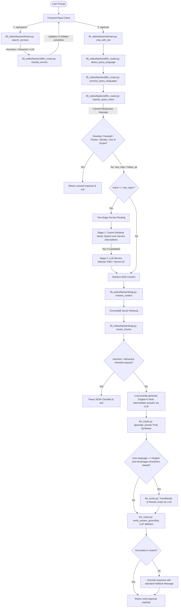

# SewaSetu Chatbot: Answer Retrieval & Generation Process

This document explains in detail how queries flow from the user's prompt through the backend, how information is retrieved and processed, where LLM and heuristics are used, and the exact count and purpose of LLM calls in each scenario.

---

## 1. High-Level Answer Generation Architecture

The RAG and LLM pipeline coordinates backend endpoints, local vector databases, and real-time verification guardrails to process citizen queries and synthesize accurate, context-bound responses.

---

## 2. Step-by-Step Lifecycle Walkthrough

### Step 2.1: Frontend Event Trigger
* When a user submits a message, the React frontend in [05_webui/frontend/src/App.jsx](file:///c:/Users/hp/Desktop/sewa%20setu%20copies/SewaSetuRag%20-%20Copy%20(2)/05_webui/frontend/src/App.jsx) updates the UI message state.
* **Service Mapping lookup**: First, the frontend makes a POST call to `/api/search` to map the query terms to a service. If a service is found, it automatically sets the active tab `selectedSno`.
* **Chat payload**: Next, the frontend sends a POST call to `/api/chat` with:
  - `messages`: Sanitized text history limited to the last 6 messages (3 turns).
  - `selected_sno`: The active tab on the sidebar.
  - `language`: Current UI language preference.
  - `interactive`: Boolean indicating if interactive components should be returned.

### Step 2.2: Language Detection and Query Translation
* Once the backend in [main.py](file:///c:/Users/hp/Desktop/sewa%20setu%20copies/SewaSetuRag%20-%20Copy%20(2)/05_webui/backend/main.py) receives the query, it triggers language detection:
  - If Devanagari characters are present, it is mapped to `"hi"` (Hindi) immediately via heuristics.
  - Otherwise, it invokes the LLM (`detect_query_language`) to identify if it is `"en"` (English) or `"hinglish"` (Roman Hindi).
* It then translates Hinglish/Hindi queries to English and English queries to Hindi using LLM translation functions (`translate_query_to_english` and `translate_query_to_hindi`) to maintain multi-language inputs.

### Step 2.3: Intent Classification & Context Sanitization
* The history is filtered by `sanitize_history` to drop empty messages, system rules, and special checklist objects.
* The backend calls the LLM intent classifier (`classify_query_intent`). The query is classified as a `greeting`, `farewell`, `thanks`, `identity`, `out_of_scope`, `follow_up`, or `new_topic`.
* Vague queries (e.g. `"fee kitni hai?"`) are rewritten in the context of history to a self-contained question (e.g. `"What is the fee for OBC Certificate?"`).

### Step 2.4: Two-Stage Service Identification & Routing
If the classified intent is `new_topic` (meaning the user is initiating a new topic or switching context), the backend triggers a scalable **Two-Stage Routing** process to map the query to the correct service catalog entry:
1. **Stage 1 (Semantic Retrieval):** The system calls `retrieve_candidate_services` which uses `multilingual-e5-large` to calculate the cosine similarity between the user's query and the manifest descriptions in `01_preprocessing/data/rag_kb_manifest.json` for all services. It returns the **Top 3** candidate services.

2. **Stage 2 (LLM Constrained Classification):** The LLM classifier (`classify_service` with `use_llm_only=True`) is provided a catalog containing *only* these Top 3 candidates and a strict set of mapping rules/few-shots. The LLM selects the correct service.
* If a new service is detected, `service_id` is updated. If the history context matches the previous service, history is cleared to prevent cross-contamination.

### Step 2.5: Document Retrieval & Reranking
* In [rag.py](file:///c:/Users/hp/Desktop/sewa%20setu%20copies/SewaSetuRag%20-%20Copy%20(2)/05_webui/backend/rag.py), the `retrieve_context` function generates query embeddings via `intfloat/multilingual-e5-large`.
* It queries the ChromaDB collection for English and Hindi text chunks matching the resolved query.
* Chunks are filtered by the active `service_id` and reranked using a hybrid scoring algorithm:
  $$\text{Score} = (0.7 \times \text{Semantic Distance Similarity}) + (0.3 \times \text{Lexical Overlap}) + \text{Combined Manual Boost}$$

### Step 2.6: Intermediate Answer Generation
* The top 4 retrieved English chunks and Hindi chunks are sent to the LLM concurrently inside `run_rag_pipeline_intermediates`.
* Two separate intermediate prompts are executed:
  1. An English prompt generating an Intermediate English Answer using English context.
  2. A Hindi prompt generating an Intermediate Hindi Answer using Hindi context.
* Both are generated with a strict **"answer-only"** system instruction to exclude unrequested aspects (e.g., if the user asked about fees, the intermediate answers contain *only* fees).

### Step 2.7: Response Synthesis & Language Romanization
* The backend calls `synthesize_consensus_response` which compiles:
  - User query and query language.
  - Both English and Hindi intermediate answers.
  - The condensed history (last 1 turn only).
* The LLM synthesizes a friendly, citizen-centric response in the target language.
* **Romanization Safety Net**: If the query language is Hinglish but the generated output contains Devanagari text, the backend executes an LLM transliteration call to Romanize the text.

### Step 2.8: Grounding Verification Guardrail (Anti-Hallucination)
To ensure the chatbot strictly answers using the provided context and never fabricates details:
* The backend invokes `verify_answer_grounding` concurrently after response generation.
* The grounding validator compares the compiled RAG context against the synthesized response using a zero-temperature LLM validation call.
* If the response contains any facts, numbers, fees, or timelines that are **not** explicitly stated in the context, the validator returns `NO`.
* **Override Intercept:** If `is_grounded` is `False`, the backend intercepts the response, prints a trace warning, and overrides the output with the language-specific fallback message (*"मेरे पास इस प्रश्न का उत्तर देने के लिए रिकॉर्ड में पर्याप्त जानकारी नहीं है..."*).

---

## 3. Inventory of LLM Calls

A standard query lifecycle makes several specific calls. Here is the inventory of all LLM calls:

| # | LLM Function Name | Purpose | Model Configuration | Triggering Condition |
|---|---|---|---|---|
| **1** | `detect_query_language` | Identifies user query language script (`en`, `hi`, `hinglish`). | `sarvam-30b`, temp=0.0 | Triggered if query lacks Devanagari characters. |
| **2** | `translate_query_to_english` | Translates Hindi or Hinglish query to standard English. | `sarvam-30b`, temp=0.0 | Triggered if detected language is `"hi"` or `"hinglish"`. |
| **3** | `translate_query_to_hindi` | Translates English query to Hindi Devanagari. | `sarvam-30b`, temp=0.0 | Triggered if detected language is `"en"` or `"hinglish"`. |
| **4** | `classify_query_intent` | Classifies user intent and resolves vague context references. | `sarvam-30b`, temp=0.0 | Always executed on every incoming chat query. |
| **5** | `classify_service` | Maps query to correct service catalog ID constrained to Top 3 candidates. | `sarvam-30b`, temp=0.0 | Executed if `intent == "new_topic"` to dynamically switch tabs. |
| **6** | `generate_answer` (English Intermediate) | Generates English answer using English RAG context. | `sarvam-30b`, temp=0.0 | Executed on standard RAG pipelines. |
| **7** | `generate_answer` (Hindi Intermediate) | Generates Hindi answer using Hindi RAG context. | `sarvam-30b`, temp=0.0 | Executed on standard RAG pipelines. |
| **8** | `generate_answer` (Synthesis) | Merges intermediate answers and history into final response. | `sarvam-30b`, temp=0.0 | Executed on standard RAG pipelines. |
| **9** | `generate_answer` (Romanize) | Transliterates Devanagari response to Roman script. | `sarvam-30b`, temp=0.0 | Executed only if query lang is Hinglish and final response has Devanagari characters. |
| **10** | `verify_answer_grounding` | Checks if synthesized reply contains ungrounded factual details. | `sarvam-30b`, temp=0.0 | Executed on every response containing synthesized answers to prevent hallucinations. |

---

## 4. Heuristics, Regular Expressions, & Hardcoded Rules

To optimize execution speed, minimize LLM costs, and handle safety edges, the chatbot utilizes rule-based code intercepts:

### A. Quick Language Script Check
* If the query matches the regex pattern for Devanagari characters: `[\u0900-\u097f]`, it is immediately classified as `"hi"`. No LLM language detection call is made.

### B. Canned Intercept Responses
If `classify_query_intent` returns one of the five early-intercept categories, the pipeline returns a hardcoded text template without querying the database or running synthesis:
* **`greeting`**: Polite welcome and service guidance message.
* **`farewell`**: Thank-you message and goodbye.
* **`thanks`**: Friendly acknowledgement.
* **`identity`**: Short description of SewaSetu chatbot capabilities.
* **`out_of_scope`**: Out-of-bounds rejection message.

### C. Normalization of Synonyms
Queries undergo dictionary mapping in `normalize_query_terms` to prevent LLM translation errors:
* Domicile Certificate synonyms ("niwas praman patra", "local resident") mapped to `"domicile certificate"`.
* Marriage Registration and Certificate synonyms ("shadi certificate", "vivah praman patra") mapped to `"marriage registration and certificate"`.
* Common document keywords like "shapath patra" mapped to `"affidavit"`.

### D. Redirection Link Appending
* When the RAG response is returned, the backend extracts the target `service_id` and appends a live instruction portal link:
  `https://sewasetu.cgstate.gov.in/instractionPageNew.do?serviceId={service_id}&lang={lang}`
* All references to raw Markdown URLs inside the synthesized text (e.g. `[link](url)`) are removed via regular expression (`re.sub(r'\[.*?\]\(https?://.*?\)', '', final_reply)`) to ensure the portal links are clean and unified.

---

## 5. Document Checklist & Interactive Flow Interceptions

If the client sets `interactive: true` and the backend detects a checklist request, the system bypasses intermediate answer generation and returns structured data:

1. **Heuristic Interception**: The query is intercepted if it matches checklist terms:
   - Contains: `"checklist"`, `"mandatory"`, `"dastavez checklist"`, `"documents list"`.
   - Or if the user explicitly clicked the UI option button `📋 Check Eligibility via Document Checklist`.
2. **Retrieve Context**: `retrieve_context` is executed with `force_checklist=True`. This fetches the raw JSON string of the structured checklist from the Chroma DB.
3. **JSON Parse**: The backend parses the raw text checklist into a JSON structure of document groups and returns it directly to the frontend under `mode: "interactive"`. No intermediate or synthesis LLM calls are executed in this mode.

---

## 6. Chronological Scenario Walkthroughs

### Walkthrough 1: Out-of-Scope Query ("who is the prime minister?")
1. **User Types**: `"who is the prime minister?"`
2. **Frontend Search**: `/api/search` called. Returned `sno: None` (no rule matched, semantic distance too high). Sidebar selection unchanged.
3. **Frontend Chat POST**: Submits message with current active `sno`.
4. **Backend Language**: Detects `"en"` (English) via LLM (1 LLM call).
5. **Backend Translation**: Translates to Hindi (1 LLM call).
6. **Backend Intent**: Classifier intent returned is `out_of_scope` (1 LLM call).
7. **Pipeline Intercept**: Hits `out_of_scope` check. Returns canned response: *"I can only help you with queries regarding Chhattisgarh citizen services..."*
8. **Total LLM Calls**: **3 calls**.

### Walkthrough 2: Standard Follow-Up Query ("aur iski fees kitni hai?")
*Background: User is currently on the Domicile Certificate page (Service ID 7).*
1. **User Types**: `"aur iski fees kitni hai?"`
2. **Backend Language Check**: Matches Devanagari script `है`. Instantly mapped to language `"hi"`. (0 LLM calls).
3. **Backend Translation**: Query translated to English (1 LLM call).
4. **Backend Intent**: Intent classified as `follow_up`. Resolved query rewritten to: `"What is the fee for Chhattisgarh Domicile Certificate?"` (1 LLM call).
5. **Backend RAG**: Retrieval queries Domicile Certificate (ID 7) documents in Chroma.
6. **Backend Intermediates**: English and Hindi intermediate answers generated concurrently (2 LLM calls).
7. **Backend Synthesis**: Intermediate answers compiled. Final Hindi response generated in Devanagari script (1 LLM call).
8. **Grounding Guardrail:** Grounding validator (`verify_answer_grounding`) checks response. Confirms all facts exist in context and returns `YES` (1 LLM call).
9. **Total LLM Calls**: **6 calls**.

### Walkthrough 3: Grounding Override (Hallucination Defended)
1. **User Types**: *"OBC income certificate slab details for domicile students"* (Query 42)
2. **Backend Language Check**: Detects `"en"` via LLM (1 LLM call).
3. **Backend Intent**: Classified as `new_topic` (1 LLM call).
4. **Two-Stage Routing:** Stage 1 Vector Search retrieves candidate list (OBC, Domicile, SC/ST). Stage 2 Dynamic Classifier maps the query to OBC Certificate (ID 5) (1 LLM call).
5. **RAG Context**: Retrieves OBC chunks. The chunks contain document checklist and fees, but *no* slab limit numbers.
6. **Backend Intermediates & Synthesis**: LLM generates draft response containing hallucinated limits: `₹8,000` and `₹12,000` (3 LLM calls).
7. **Grounding Guardrail:** `verify_answer_grounding` evaluates the context vs response. Identifies that the numbers `₹8,000` and `₹12,000` do not exist in the context, and returns `NO` (1 LLM call).
8. **Pipeline Intercept:** Grounding check failed. Backend overrides draft reply and returns the standard fallback message directly to the user.
9. **Total LLM Calls**: **7 calls**.
