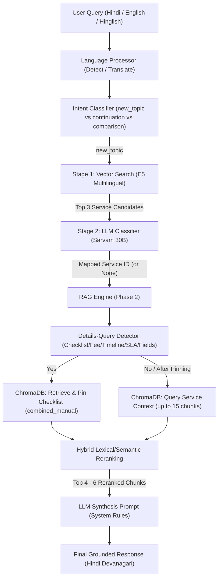

# SewaSetu RAG Pipeline: Detailed Technical Architecture

This document provides a comprehensive, end-to-end technical explanation of how the SewaSetu RAG (Retrieval-Augmented Generation) system processes queries, routes them to specific services, retrieves grounded context, and synthesizes final responses.

---

## Architecture Overview

The system is designed as a **two-phase pipeline** to ensure highly accurate service matching, zero hardcoded routing rules, and strict factual grounding:
1. **Phase 1: Query Processing & Service Classification (Routing)**
2. **Phase 2: Hybrid Context Retrieval & Response Synthesis**



---

## Phase 1: Query Processing & Service Classification (Routing)

The routing subsystem maps user input to the correct service catalog entry before querying the database. This prevents noise from unrelated service rules from polluting the context window.

### 1. Language Detection & Translation
- **Input**: The raw user query.
- **Language Detection**: The system uses `detect_query_language` to identify if the input is `hi` (Hindi), `hinglish` (Hindi in Latin script), or `en` (English).
- **Translation**: 
  - If the query is in Hindi or Hinglish, `translate_query_to_english` translates it.
  - If the query is in English or Hinglish, `translate_query_to_hindi` translates it.
  - This guarantees that bilingual query versions (English & Hindi) are available for search optimization.

### 2. Intent Classification
- The `classify_query_intent` agent evaluates the query against the conversation history to determine:
  - `new_topic`: The user is starting a fresh inquiry.
  - `continuation`: The query relies on the previous message's context.
  - `comparison` or `out_of_scope`: General questions matching multiple services or outside of the catalog.
- If it is a `new_topic`, the pipeline initiates the **Two-Stage Routing** process.

### 3. Stage 1 Vector Retrieval (Coarse-Grained Routing)
- The system embeds the query using `intfloat/multilingual-e5-large`. The query is prefixed with `query: ` as per the E5 model guidelines.
- It computes the **cosine similarity** between the query vector and pre-computed embeddings of the available service catalog names:
  $$\text{Cosine Similarity} = \frac{\mathbf{u} \cdot \mathbf{v}}{\|\mathbf{u}\| \|\mathbf{v}\|}$$
- This step acts as a fast vector filter and retrieves the **top 3 candidate services** (e.g. Domicile Certificate, SC/ST Certificate, Gazette Name Change).

### 4. Stage 2 LLM-Based Service Classifier (Fine-Grained Routing)
- The top 3 candidates from Stage 1 are passed to the `classify_service` LLM completion endpoint along with:
  1. Detailed **Classification Rules** (e.g., target service rule, issued document correction vs. form typo correction, comparisons).
  2. Language-specific **Few-Shot Examples** illustrating how complex queries map.
- The LLM parses this context and returns a structured JSON mapping:
  ```json
  {
    "sno": "2",
    "service_id": "4"
  }
  ```
- If the query is out of scope or represents a cross-service comparison (e.g., "OBC fee vs SC/ST fee"), the LLM maps both keys to `null`. This prevents the RAG pipeline from pinning a single service database filter, allowing a full collection search.

---

## Phase 2: Context Retrieval & Response Synthesis

Once the service category is classified, the RAG engine queries the vector database and formats the context for synthesis.

### 1. Details-Query Detection & Checklist Pinning
- The pipeline scans the user query for keywords related to checklists, required documents, fees, SLA timelines, department names, or application form fields.
- If a match is found (e.g., the user asks *"what documents do I need?"*):
  - The engine runs a targeted vector search on ChromaDB for the mapped `service_id` looking specifically for `"REQUIRED DOCUMENTS"` or `"आवश्यक दस्तावेज़"`.
  - It locates the **Combined Manual Checklist** chunk.
  - This checklist chunk is **pinned at Rank 1** to guarantee that the primary checklist manual is never omitted or diluted by other chunks during reranking.

### 2. ChromaDB Retrieval
- The RAG engine executes a query against ChromaDB using the mapped `service_id` and target language (`hi` or `en`) as filters.
- It retrieves up to **15 candidate chunks** from two primary document sections:
  - `combined_manual`: Simplified citizen charter guides and manuals.
  - `official_document`: Legal rules, gazette acts, and official legislation.

### 3. Hybrid Lexical & Semantic Reranking
To combat semantic dilution (where vector search retrieves terms with similar meanings but matching different contexts), the system ranks retrieved chunks using a **Hybrid Score**:
$$\text{Hybrid Score} = 0.7 \times \text{Semantic Similarity} + 0.3 \times \text{Lexical Overlap}$$
- **Semantic Similarity** is calculated by converting the vector cosine distance:
  $$\text{Semantic Similarity} = \max(0.0, 1.0 - \frac{\text{Distance}}{2.0})$$
- **Lexical Overlap** measures keyword intersection between the tokenized query and the chunk text (excluding common stop-words):
  $$\text{Lexical Overlap} = \frac{|\text{Query Keywords} \cap \text{Chunk Words}|}{|\text{Query Keywords}|}$$
- The top 4 to 6 chunks (depending on whether a checklist was pinned) are selected for the final LLM prompt.

### 4. Response Synthesis & Prompt Constraints
The top-ranked chunks are injected into the system prompt. The synthesis LLM is bound by strict parameters:
- **Strict Grounding (No Extrapolation)**: The model is forbidden from using external knowledge or assumptions. It is allowed to perform simple calculations and logical deductions (e.g., matching a user's stated delay of 1 year against a 30-day deadline to apply a penalty).
- **Mandatoriness vs Optionality**: Optional documents (marked `Mandatory: No`) must be described as optional/alternative. Mandatory documents (marked `Mandatory: Yes`) are strictly required.
- **Language & Script Constraints**: Responses to Hindi queries must be generated entirely in Hindi using the Devanagari script (no Latin letters, transliterated terms like "affidavit" must become "शपथ पत्र").
- **Brevity**: Single-aspect questions must receive short, precise responses (2–5 lines).
- **Fallback**: If the query refers to an out-of-scope person/topic, or if the source documents lack the necessary details, the bot replies with the standardized language-specific fallback message.
