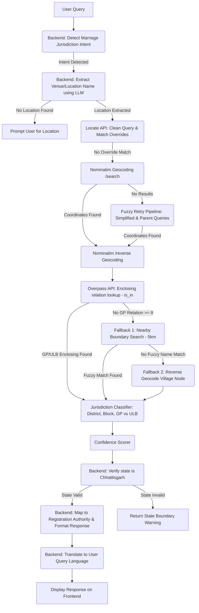

# Geospatial Resolution & Administrative Boundary Extraction Architecture

This document provides a detailed technical explanation of the end-to-end workflow, data layers, and algorithmic processes used in the SewaSetu RAG system to resolve free-text user locations (venues, villages, temples, resorts) to their precise administrative jurisdictions (Gram Panchayats or Urban Local Bodies) for marriage registration.

---

## Technical Architecture Overview

The system operates as a hybrid architecture:
1. **SewaSetu RAG Backend (FastAPI, Port 8000)**: Serves as the user-facing chat assistant, intercepts queries, extracts location strings using LLMs, and formats/translates final answers.
2. **Geospatial Resolution Microservice (FastAPI, Port 8001)**: Interacts with OpenStreetMap (OSM) public geocoding servers (Nominatim) and the spatial database engine (Overpass API) to fetch enclosing and nearby administrative boundary geometries.

### Pipeline Workflow Diagram



---

## Detailed Step-by-Step Workflow

### Phase 1: Query Interception & Intent Detection
When a user sends a chat message, the backend (`backend/main.py`) processes the query:
* **Intent Detection (`detect_marriage_jurisdiction_intent`)**:
  An LLM prompt determines if the query pertains to finding the right jurisdiction or authority for marriage registration based on location names, halls, temples, or towns.
  - *Fallback Keyword Check*: If the LLM call fails, the system scans for keywords (`marriage`, `wedding`, `shadi`, `vivah`) paired with inquiry terms (`where`, `how`, `authority`, `panchayat`, `corporation`).
* **Conversational Context Intercept**:
  If the last response from the assistant asked the user to specify their wedding location, the system treats the subsequent input as the location even if it does not match the default intent.
* **Venue/Location Extraction (`extract_marriage_venue`)**:
  The system uses a focused LLM prompt to strip out conversational fillers and extract *only* the proper name of the venue or location (e.g. *"Mayfair Resort Raipur"*, *"Shri Ram Vatika Dhamtari"*).

### Phase 2: Geocoding & Text Preprocessing
The extracted location string is sent via a POST request to `/chatbot/locate` on the Geospatial Microservice (`chatbotlocation/services/geocoding_service.py`):
1. **Chatbot Phrase Cleanup**:
   Regex filters strip common Hindi/Hinglish suffixes (e.g., *"...me aata hai"*, *"...ke under aata hai"*) and English prefixes/suffixes (e.g., *"comes under which gp"*, *"where is"*).
2. **Landmark Overrides**:
   Before querying live APIs, the query is checked against custom coordinate overrides for famous local landmarks (e.g., `Mayfair Lake Resort`, `Hyatt Raipur`, `Mana Camp`, `Hotel Hukam's Lalit Mahal`). If matched, it bypasses geocoding with hardcoded coordinates.
3. **Nominatim `/search` Geocoding**:
   If no override is matched, the system queries Nominatim `/search` with parameters targeting India (`countrycodes=in`) and filters results to Chhattisgarh.
4. **Fuzzy Retry Pipeline**:
   If Nominatim returns no results (due to typo or word order differences):
   - *Attempt 1 (Simplified Search)*: Queries using only the first and last word of the location (e.g., *"Mayfair Raipur"* instead of *"Mayfair Lake Resort Raipur"*). Results are fuzzy-ranked against the original query using `rapidfuzz`.
   - *Attempt 2 (Parent Search)*: Strips off the specific venue name (which Nominatim may not have indexed) and geocodes the parent locality, block, or city district (e.g., *"Atal Nagar, Raipur"*).

### Phase 3: Reverse Geocoding & Address Cross-check
Once coordinates are acquired:
* A reverse geocoding request (`/reverse`) is sent to Nominatim to resolve coordinates back to administrative address fields (`village`, `county`, `state_district`, `state`, etc.).
* These address fields are used to cross-reference and validate the results of the subsequent boundary geometry query.

### Phase 4: Enclosing Administrative Boundary Extraction
The microservice queries the OpenStreetMap database via the **Overpass API** (`chatbotlocation/services/boundary_hierarchy_service.py`):
* **Spatial Query (`is_in`)**:
  Using the Overpass spatial instruction `is_in(lat, lon)`, it identifies all enclosing polygon geometry relations that represent administrative borders:
  ```osm
  [out:json][timeout:25];
  is_in({lat},{lon})->.a;
  (
    relation(pivot.a)[boundary=administrative];
    way(pivot.a)[boundary=administrative];
  );
  out tags;
  ```
* **Boundary Sorting**:
  Overpass returns the set of administrative boundary names along with their official `admin_level` tags. The results are sorted ascending by `admin_level`.

### Phase 5: Handling Patchy/Rural Data Gaps
In rural regions of India, administrative boundary polygons at the Gram Panchayat level (`admin_level=8` or `9`) are often missing or unmapped in OpenStreetMap. To ensure robustness, the system implements a cascading fallback pipeline:
1. **Direct Match**: If an enclosing relation of `admin_level` $\ge$ 8 exists, the system resolves it directly.
2. **Fallback 1 (Nearby Relations)**: If no enclosing relation exists for the GP level, the system executes an `around` query on Overpass, searching for any administrative boundaries within a **5 km radius**:
   ```osm
   relation(around:5000,{lat},{lon})[boundary=administrative];
   ```
   It then fuzzy-compares the names of these nearby boundaries against the Nominatim-resolved village name or user query. If a match of $\ge$ 80% similarity is found, it adopts that boundary.
3. **Fallback 2 (Reverse Geocode Node)**: If no nearby boundaries fuzzy-match, the system extracts the `village` or locality name string from the Nominatim reverse geocode address structure and adopts it as the unconfirmed Gram Panchayat name.

---

## Conceptual Details: Administrative Boundary Layers

India's administrative boundary framework is mapped in OpenStreetMap using the `admin_level` tag, which varies by state. In Chhattisgarh, the mapping hierarchy resolves as follows:

| Admin Level | Administrative Tier | resolved as | Mapping Authority |
| :--- | :--- | :--- | :--- |
| **admin_level = 2** | Country | India | N/A |
| **admin_level = 4** | State | Chhattisgarh | N/A |
| **admin_level = 6** | District (Zila) | Raipur / Dhamtari / etc. | District Collector |
| **admin_level = 7** | Block / Tehsil | Abhanpur / Kurud / etc. | Janpad Panchayat |
| **admin_level = 8** | Gram Panchayat / ULB | Kharora GP / Raipur Municipal Corp | Panchayat Secretary / Ward Officer |

### Jurisdiction Classification (`jurisdiction_classifier.py`)
To map the resolved boundaries to the correct government registry:
* **GP vs. ULB Classification**: Heuristics classify the local body:
  - **ULB (Urban Local Body)**: Triggered by keywords in the boundary tags or names like `Nagar Nigam`, `Municipal Corporation`, `Nagar Palika`, `Nagar Panchayat`, `Ward`.
  - **Gram Panchayat (Rural)**: Triggered by keywords like `Gram Panchayat`, `GP`, or tag `place=village`.
* **Registration Authority Assignment**:
  - If classified as **ULB**, the citizen is instructed to apply at the specific Municipal Corporation / Council Office (Ward Officer / Registrar).
  - If classified as **Gram Panchayat**, the citizen is instructed to apply at the specific Gram Panchayat Office (Panchayat Secretary).

---

## Confidence Scoring & Risk Mitigation

Each resolved location query is assigned a confidence score dynamically by `confidence_scorer.py`:
* **Base Score**:
  - Enclosing relation found: **0.80**
  - Nearby relation matched: **0.50**
  - Fallback village address node: **0.30**
* **Modifiers**:
  - Name agreement bonus: **+0.15** (if Nominatim's reverse geocode matches the Overpass boundary name)
  - Nominatim importance score: Additive factor based on query matching importance.
* **Risk Warnings**:
  - **High Confidence ($\ge 0.70$)**: Standard resolution.
  - **Medium Confidence ($0.40 \text{ to } 0.69$)**: Warns the user that a nearby boundary match was used.
  - **Low Confidence ($< 0.40$)**: Appends a warning alert in the chat, advising the user to verify the exact jurisdiction details locally before submitting application documents due to low geocoding precision or missing map data.

---

## Response Formatting & Multi-Language Translation

1. **State Bounds Check**: The system validates that the coordinates fall inside the boundary of Chhattisgarh. If the location is outside, it explicitly informs the user that only Chhattisgarh locations are supported.
2. **Human-Facing Message Construction**: The system formats the administrative details cleanly:
   - Marriage Location: *[Extracted location]*
   - Village/Locality: *[Resolved locality]*
   - Gram Panchayat / ULB: *[Resolved GP or ULB]*
   - Block/Tehsil: *[Resolved Block]*
   - District: *[Resolved District]*
   - Final instructions on the exact authority title and reasoning.
3. **Translation**: The final structured markdown text is dynamically translated using the `translate_response` utility to match the user's querying language (English, Hindi, or Hinglish), ensuring accessibility for all citizens.
