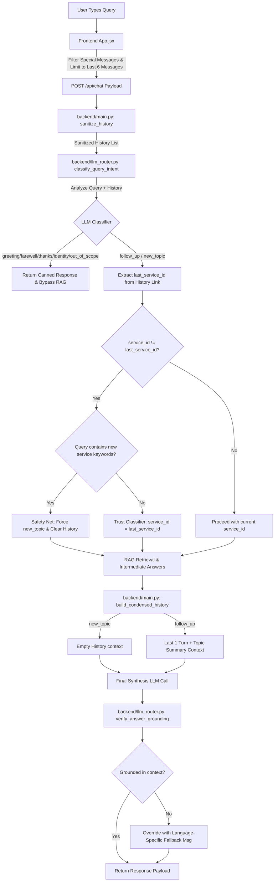

# SewaSetu Chatbot: Conversation History Workflow & Architecture

This document explains in detail how conversation history is stored, processed, classified, and utilized in the **SewaSetu RAG-based AI Assistant** to prevent context contamination and ensure precise, context-aware responses.

---

## 1. High-Level History Workflow

The diagram below illustrates how user query history flows from the frontend client through backend intent classification, context switches, RAG processing, and the final grounding guardrail check:

---

## 2. History Lifecycle & Storage

### A. Frontend Storage (`frontend/src/components/App.jsx`)
- **State**: The chatbot frontend stores the conversation history in a React state array of message objects: `[{ role: "user" | "assistant", content: "...", ... }]`.
- **Filtering**: Before posting the history to `/api/chat`, the frontend filters out ad-hoc UI messages (such as `interactive_checklist` or `options` buttons) to avoid polluting the textual context.
- **Length Constraint**: The frontend limits the history sent in the API payload to the **last 6 messages (3 turns)**. This keeps token usage optimal and prevents the LLM context window from overflowing.

### B. Backend Sanitization (`backend/main.py`)
- **Function**: `sanitize_history(messages)`
- **Role**: Receives the raw history list from the client request. It strips out any system messages, removes empty/null text content, and returns a clean list of `user` and `assistant` message dicts.

---

## 3. History Classification & Intent Resolution

When a new query arrives, it is classified in the context of the sanitized history:

### A. The Classifier (`backend/llm_router.py`)
- **Function**: `classify_query_intent(query, history_msgs)`
- **Role**: Combines the sanitized history and the latest user query, truncating assistant responses to `150` characters to save tokens while keeping context.
- **Intents Classified**:
  1. `greeting` — Early salutations (bypasses RAG).
  2. `farewell` — Goodbye messages (bypasses RAG).
  3. `thanks` — Thank you / simple acknowledgements (bypasses RAG).
  4. `identity` — "Who are you?" type chatbot queries (bypasses RAG).
  5. `out_of_scope` — Off-topic queries (bypasses RAG).
  6. `follow_up` — Question is about the **same** service as the previous turn (RAG retrieval enabled).
  7. `new_topic` — Question switches to a **different** service (RAG retrieval enabled).
- **Query Resolution**: For follow-ups and service switches with implied contexts, the LLM rewrites the vague input (e.g. `"and for marriage?"` or `"how much?"`) into a fully self-contained search query (e.g. `"What are the fees for marriage registration?"`).

---

## 4. History Isolation & Safety Nets

To prevent context contamination (e.g., marriage timeline showing up when asking about domicile), the backend uses three main isolation techniques:

### A. Link-Based Service Tracking
- The backend parses redirect links inside the assistant's previous message to find the active service (e.g., `serviceId=3`).
- If `service_id` (requested sidebar tab) differs from `last_service_id` (active conversation service), the pipeline detects a potential service switch.

### B. Programmatic Switch Safety Net
- **Function**: `query_contains_service_keywords(query, resolved_query, service_id)`
- **Role**: Searches the query/resolved query for explicit service terms (e.g., "shadi", "marriage", "caste", "domicile").
- If a service switch is indicated, but the LLM classifier mistakenly outputs a `follow_up`, the safety net overrides the intent to `new_topic` and forces a history clear.

### C. History Condensation
- **Function**: `build_condensed_history(sanitized_history, is_follow_up, topic_summary)`
- **Role**: Prepares the history list for the final synthesis LLM prompt:
  - **For `new_topic`**: Returns `[]`. The history is cleared so that the previous service's context does not leak into the new response.
  - **For `follow_up`**: Returns only the **last 1 turn (2 messages)** + a concise `topic_summary` indicating what is being discussed. This strictly prevents the **triple-amplification problem** where old details are synthesized repeatedly.

### D. Grounding Defences (Anti-Hallucination)
- **Role**: Even if history contains ambiguous information or a service switch is incorrectly classified leading to slightly off-topic RAG context retrieval, the **Grounding Verification Guardrail** (`verify_answer_grounding`) acts as a final safety check. It ensures that the generated response is strictly grounded in the retrieved chunks before presenting it to the citizen, preventing hallucination leakage caused by context drift.

---

## 5. Function-by-Function Reference

### 1. `sanitize_history(messages: Optional[list]) -> list`
* **File**: [backend/main.py](file:///c:/Users/hp/Desktop/sewa%20setu%20copies/SewaSetuRag%20-%20Copy%20(2)/backend/main.py)
* **Arguments**: List of raw messages from payload.
* **Returns**: Filtered list of dictionaries containing only `role` and `content` keys for valid text exchanges.

### 2. `classify_query_intent(query: str, history_msgs: list) -> Dict[str, str]`
* **File**: [backend/llm_router.py](file:///c:/Users/hp%20setu%20copies/SewaSetuRag%20-%20Copy%20(2)/backend/llm_router.py)
* **Arguments**: Current user query and sanitized history.
* **Returns**: JSON dictionary with `intent`, `resolved_query` (fully self-contained rewrite), and `topic_summary` details.

### 3. `query_contains_service_keywords(query: str, resolved_query: str, service_id: int) -> bool`
* **File**: [backend/main.py](file:///c:/Users/hp/Desktop/sewa%20setu%20copies/SewaSetuRag%20-%20Copy%20(2)/backend/main.py)
* **Arguments**: Original query, LLM resolved query, and target service ID.
* **Returns**: `True` if keywords for the specified `service_id` are found, `False` otherwise. Used to verify service switches.

### 4. `build_condensed_history(sanitized_history: list, is_follow_up: bool, topic_summary: str = "") -> list`
* **File**: [backend/main.py](file:///c:/Users/hp/Desktop/sewa%20setu%20copies/SewaSetuRag%20-%20Copy%20(2)/backend/main.py)
* **Arguments**: Sanitized history, boolean flag `is_follow_up`, and topic summary string.
* **Returns**: A list of messages containing only the last 1 turn + a topic context wrapper, or empty list if `is_follow_up` is False.

### 5. `get_intent_response(intent: str, query: str) -> Optional[dict]`
* **File**: [backend/main.py](file:///c:/Users/hp/Desktop/sewa%20setu%20copies/SewaSetuRag%20-%20Copy%20(2)/backend/main.py)
* **Arguments**: Classified intent and query.
* **Returns**: An immediate dictionary containing the canned response for early intercept intents (greetings, identity, etc.), or `None` if the query is a service-related topic that needs RAG processing.
